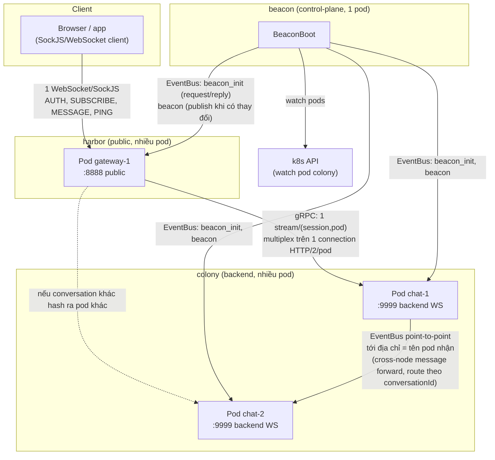
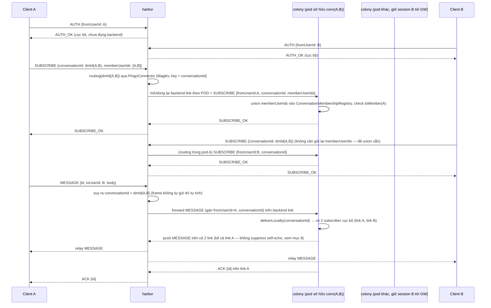
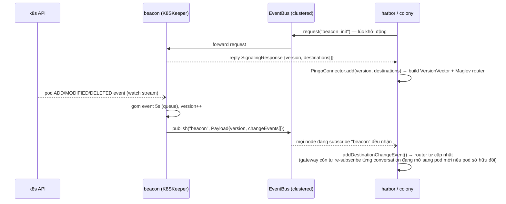

# Kiến trúc hệ thống Pingo Chat

Tài liệu này mô tả tổng thể kiến trúc, luồng dữ liệu, và các quyết định thiết kế của hệ thống chat
gồm 6 module: `discovery`, `beacon`, `harbor`, `colony`, `hall`, `chat-domain`.

## 1. Tổng quan

- Toàn bộ service viết trên **Vert.x**, giao tiếp nội bộ qua **EventBus** đã clustering bằng
  **Hazelcast** (mọi node trong cùng 1 cluster thấy chung 1 EventBus logic).
- Routing tin nhắn tới đúng backend node dùng **consistent hashing (thuật toán Maglev)** dựa trên
  `conversationId` (KHÔNG phải `userId`) — 1-1 (DM) và group chat dùng chung 1 model: DM chỉ là 1
  conversation 2 thành viên, `conversationId` tính tất định từ cặp userId (xem mục 3, 11). Khi số
  lượng pod colony thay đổi, chỉ một phần nhỏ conversation bị "route lại", không phải toàn bộ.
- `beacon` là control-plane: theo dõi pod colony nào đang sống, phát (gossip) danh sách đó
  cho `harbor` và `colony`.
- `harbor` là cửa ngõ public (client kết nối vào qua SockJS/WebSocket), không giữ trạng thái chat —
  chỉ relay. Chặng harbor↔colony chạy gRPC: mỗi (session, pod colony) có đúng 1 stream riêng, nhiều
  stream của nhiều session cùng multiplex trên CHUNG 1 connection HTTP/2 vật lý/pod (xem mục 12).
- `colony` là nơi thật sự giữ subscriber của từng conversation và deliver tin nhắn cho đúng subscriber
  cục bộ, hoặc forward sang đúng pod đang sở hữu conversation đó. 1 subscriber (`ChatSession`) ứng
  với đúng 1 gRPC stream — nhiều subscriber vẫn có thể cùng multiplex chung 1 connection HTTP/2. Chỉ
  còn lo đúng chặng chat real-time — REST API đã tách sang `hall` (xem mục 13).
- `hall` là service REST độc lập (auth, lịch sử tin nhắn, danh sách conversation/user) — KHÔNG
  cluster Hazelcast, không giữ trạng thái chat, chỉ đọc/ghi Postgres qua `chat-domain` (xem mục 13).
- `discovery` là thư viện dùng chung (routing, versioning, connector) — không phải service độc lập,
  không có `main()`. `chat-domain` cùng vai trò nhưng cho domain chat (registry Postgres dùng chung
  giữa `colony` và `hall`, cộng `link.proto` — hợp đồng gRPC dùng chung giữa `colony` và `harbor`).



## 2. Vai trò từng module

| Module | Có `main()`? | Vai trò |
|---|---|---|
| `discovery` | Không (thư viện) | `PingoConnector`/`VersionVector`/`Router` (Maglev) — client-side: tra routing table biết `conversationId` thuộc pod nào, gửi tin nhắn cross-node qua EventBus. `Router`/`Maglev`/`VersionVector` hoàn toàn generic (route theo `RoutingKey.hash()`, không biết gì về userId/conversationId) — sự khác biệt nằm ở `RouteByUserIdRequest`/`RouteByConversationIdRequest`, 2 implementation cụ thể của `RoutingKey`. Định nghĩa chung `SocketFrame`-adjacent DTO cho gossip (`Payload`, `SignalingResponse`), `Destination`, `Keeper` (snapshot). |
| `beacon` | Có | Control-plane duy nhất nói chuyện trực tiếp với **k8s API** (`K8SKeeper`, watch pod colony theo label `app=colony`) — CHỈ watch pod `colony` (chat), không đụng gì tới `hall`. Healthcheck pod colony qua `admHttp` (8086, `/healthcheck`) trước khi coi là destination hợp lệ. Gossip danh sách destination qua EventBus (`RoutingGossipPublisher`). Không đụng gì tới việc đổi routing key sang `conversationId` — chỉ gossip topology pod (ADD/REMOVE), không biết gì về conversation. Chạy local (không k8s) thì dùng `LocalKeeper` với 1 destination cố định. |
| `harbor` | Có | Public-facing. Nhận SockJS/WebSocket từ client thật, xác thực (AUTH, chỉ xử lý cục bộ) rồi, khi client SUBSCRIBE 1 `conversationId`, mở (hoặc dùng lại) 1 gRPC stream xuống đúng pod colony sở hữu conversation đó (1 stream riêng cho mỗi cặp (session, pod), xem mục 12), relay frame 2 chiều. `BackendStreamGateway` chỉ còn giữ CHUNG 1 `GrpcClient` (= 1 pool connection HTTP/2 vật lý)/pod colony — HTTP/2 tự multiplex mọi stream của mọi session trên đó. |
| `colony` | Có | Nhận MESSAGE, deliver thẳng nếu conversation có subscriber cục bộ, hoặc forward qua EventBus sang đúng pod đang sở hữu conversation đó (theo Maglev hash của `conversationId`). **Không kết nối trực tiếp với browser** — nhận kết nối gRPC (`Link.Stream`) từ harbor, 1 `ChatSession` = 1 gRPC stream = 1 harbor session, port 9999 không public ra ngoài (xem mục 12). Chỉ còn đúng 1 route HTTP nội bộ (`HealthCheckVerticle`, `admHttp:8086/healthcheck`) — mọi REST khác đã tách sang `hall`. |
| `hall` | Có | REST API (auth, lịch sử tin nhắn, danh sách conversation/user) — service ĐỘC LẬP với `colony`, không cluster Hazelcast/EventBus (mọi route chỉ đọc/ghi Postgres qua `chat-domain`, không cần biết pod colony nào đang sống). Public trên `publicHttp:8085` (NodePort 31002, giữ nguyên từ trước khi tách). |
| `chat-domain` | Không (thư viện) | `ConversationMembershipRegistry`/`MessageHistoryRegistry` (dùng chung bởi CẢ `colony` lẫn `hall` — mỗi service tự mở `JdbcConnectionSupplier` riêng, không gọi mạng qua lại), `UserRegistry` (chỉ `hall` dùng), cộng `link.proto`/`Frame`/`LinkGrpc` (dùng chung bởi CẢ `colony` lẫn `harbor`, chặng gRPC, xem mục 12) — gọi là "chat-domain" vì không thuộc riêng service nào, không đặt tên theo 1 service cụ thể. |

## 3. Giao thức `SocketFrame` (chặng client↔harbor)

**Chỉ mô tả chặng client↔harbor** — chặng harbor↔colony dùng 1 giao thức khác hẳn (protobuf/gRPC,
xem mục 12) kể từ khi chuyển sang gRPC; trước đó 2 chặng dùng chung 1 envelope JSON, không còn nữa.

Client↔harbor dùng 1 envelope JSON:

```json
{
  "type": "AUTH | AUTH_OK | AUTH_ERROR | SUBSCRIBE | SUBSCRIBE_OK | SUBSCRIBE_ERROR | MESSAGE | ACK | ERROR | PING | PONG",
  "id": "correlation id — client tự sinh, server echo lại trong ACK/ERROR/SUBSCRIBE_OK/SUBSCRIBE_ERROR",
  "fromUserId": "sender — server tự gán khi xử lý MESSAGE, không tin giá trị client gửi lên",
  "toUserId": "recipient — CHỈ còn mang tính tiện lợi cho client (DM), KHÔNG dùng để route",
  "conversationId": "id conversation (DM hoặc group) — routing key thật sự, bắt buộc với MESSAGE/SUBSCRIBE",
  "memberUserIds": "chỉ có ý nghĩa với SUBSCRIBE — danh sách userId cần union vào membership (lazy-create/join)",
  "body": "payload tuỳ ý",
  "reason": "lý do lỗi — chỉ có ở ERROR/AUTH_ERROR/SUBSCRIBE_ERROR",
  "ts": "epoch millis, server đóng dấu"
}
```

Gửi dạng **TEXT frame** (không phải binary) — bắt buộc, vì browser/JS `WebSocket` mặc định trả
`event.data` là `Blob` cho binary frame, `JSON.parse()` sẽ lỗi ngay (xem
`harbor/.../session/HarborSession.java`).

**`AUTH` tách hẳn khỏi việc mở kết nối backend** (khác thiết kế ban đầu): giờ chỉ xác định danh
tính (`userId`) cho session, xử lý 100% cục bộ tại `harbor`, không đụng gì tới `colony`. `SUBSCRIBE`
mới là handshake thật sự mở/dùng lại backend link — xem mục 4, 11.

Với DM, client vẫn có thể chỉ gửi `toUserId` (không tự tính `conversationId`) — `harbor` tự suy ra
bằng hàm dùng chung `ConversationIds.dmId(fromUserId, toUserId)` (`core/commons-lang`, XOR 2 nửa
UUID, đối xứng — `dmId(A,B) == dmId(B,A)`).

## 4. Luồng AUTH + SUBSCRIBE + gửi tin nhắn (2 user khác pod colony)

**Lưu ý quan trọng**: `colony` không bao giờ giữ kết nối trực tiếp tới browser. Client luôn
chỉ nói chuyện với `harbor` qua SockJS; 1 "subscriber" mà `colony` giữ cho 1 conversation chính là
link WebSocket từ gateway (đăng ký lúc SUBSCRIBE). Vì vậy khi B nhận được tin nhắn, đường đi luôn
phải vòng lại qua đúng gateway đang giữ kết nối SockJS thật của B — dưới đây giả định A và B đang ở
cùng 1 gateway để sơ đồ gọn, nhưng về nguyên tắc mỗi client có thể ở 1 pod gateway khác nhau (gateway
không giữ trạng thái nên không quan trọng client nối vào pod gateway nào).

**Client PHẢI chủ động SUBSCRIBE trước khi có thể NHẬN tin nhắn của 1 conversation** — kể cả DM.
Đây là khác biệt hành vi lớn nhất so với thiết kế cũ (trước đây AUTH xong là tự động "online" nhận
được mọi tin gửi tới `toUserId` mình): giờ mỗi session phải đăng ký quan tâm (subscribe) rõ ràng
từng conversation, giống mô hình "join channel" hơn là "always-on theo userId".



**Điểm mấu chốt cho cross-node delivery đúng**: mỗi pod colony lắng nghe EventBus trên
địa chỉ = **chính định danh của nó** (`serverId` — tên pod k8s, hoặc giá trị fallback khi chạy local
dev), KHÔNG dùng chung 1 địa chỉ tĩnh cho mọi pod. Nếu dùng chung địa chỉ, EventBus sẽ round-robin
tin nhắn tới bất kỳ pod nào đang lắng nghe chứ không phải đúng pod sở hữu conversation.

## 5. Luồng đồng bộ routing table (beacon → gateway/chat)



`beacon` tự chọn giữa 2 chế độ lúc khởi động (`BeaconAppModule`):
- Có biến môi trường `KUBERNETES_SERVICE_HOST` (kubelet luôn tự set khi chạy trong pod k8s) →
  dùng `K8SKeeper`, watch thật qua k8s API.
- Không có → dùng `LocalKeeper`, 1 destination cố định `eb_gossip_adm @ 127.0.0.1` (chạy local dev,
  không cần k8s).

`beacon` hoàn toàn không đổi bởi việc chuyển routing key sang `conversationId` — nó chỉ gossip
topology pod, không biết gì về conversation/user.

## 6. Cấu trúc package `ws/` (harbor & colony)

Cả 2 module tổ chức package theo cùng 1 quy ước để đọc là hiểu ngay vai trò:

```
harbor/ws/           colony/ws/
  dto/                              (không còn dto/ — colony không có wire format
    MessageType                      riêng nào nữa, chặng harbor↔colony dùng thẳng
    SocketFrame                      Frame/FrameType sinh từ discovery/*.proto)
    SocketFrames   (frame builder)
  session/                          session/
    HarborSession  (1 client conn,     ChatSession    (1 gRPC stream = 1 harbor
     giữ backendStreams: Map<pod,       session, giữ userId/conversationIds
     BackendStream>)                    riêng, send() = response.write(Frame))
    BackendStream  (1 gRPC stream      SessionRegistry (1 tầng: tra theo
     = 1 cặp (session,pod))              userId VÀ conversationId)
    MessageSocket  (interface)
  backend/                          delivery/
    BackendStreamGateway               MessageDelivery
    (1 GrpcClient/pod dùng CHUNG        (deliver local / forward EventBus,
     cho mọi session — HTTP/2 tự        payload giờ là Frame.toByteArray(),
     multiplex; single-flight           không phải JSON — xem mục 12)
     connect, evict-on-proven-       membership/
     failure — xem mục 12)              ConversationMembershipRegistry
  routing/                              (Postgres, ai thuộc conversation nào)
    RoutingVersionSync                routing/
    (đồng bộ version + re-subscribe    RoutingVersionSync
     từng (session,conversationId)     (đồng bộ version, không cần di chuyển
     đang mở khi pod sở hữu đổi)        gì — chat không chủ động dial ra)
  HarborSessionManager (cửa trước) ChatSessionManager (cửa trước)
  HarborSocketServer   (verticle)  ChatSocketServer   (verticle, mount GrpcServer
                                     lên HttpServer HTTP/2 thuần — xem mục 12)
```

Phần chung cho việc đồng bộ routing version (`signalingInit`, lắng nghe broadcast "beacon", track
`currentVersion`) nằm ở `discovery/.../router/RoutingVersionTracker.java` (abstract, template method
`onSignalingChanged`) — `RoutingVersionSync` ở cả 2 module chỉ còn phần riêng (harbor: di chuyển
session; colony: track version đơn thuần), tránh 2 bản copy tự trôi khác nhau theo thời gian.

- **`dto`** (chỉ còn ở harbor) — định dạng frame trên dây cho chặng client↔harbor (JSON). Chặng
  harbor↔colony không còn dto riêng — dùng thẳng `Frame`/`FrameType` sinh từ
  `discovery/src/main/proto/link.proto` (1 schema dùng chung, compile 1 lần — xem mục 12).
- **`session`** — biểu diễn 1 connection/stream đang sống + tra cứu. HTTP/2 tự multiplex nhiều
  `BackendStream`/`ChatSession` trên CHUNG 1 connection vật lý, nên không còn cần tách connection vật
  lý khỏi subscriber logic như thời N-shard-link nữa (xem mục 12).
- **`backend`/`delivery`** — quyết định tin nhắn phải đi đâu và đưa nó đi.
- **`membership`** (chỉ colony, `ConversationMembershipRegistry`) — ai thuộc conversation nào, lưu bền trong Postgres (xem mục 8).
- **`routing`** — biết pod nào đang sở hữu conversation nào (dựa trên gossip từ beacon).
- File ở gốc package (`*Manager`, `*Server`) — nơi ráp mọi thứ lại, là "cửa trước" nhận connection
  và dispatch protocol.

## 7. Chạy local (không cần k8s)

Cả 3 service (`beacon`, `colony`, `harbor`) chạy độc lập trên cùng máy, tự ghép
cụm Hazelcast qua multicast (không cần cấu hình thêm):

```bash
mvn -pl beacon exec:java -Dexec.mainClass=com.pingo.beacon.BeaconBoot
mvn -pl colony exec:java -Dexec.mainClass=com.pingo.colony.ColonyBoot
mvn -pl harbor exec:java -Dexec.mainClass=com.pingo.harbor.HarborBoot
```

Client test thủ công: mở `demo.html` (ở root repo) trong browser (SockJS raw-websocket transport
tới `ws://localhost:8888/connect/websocket`, hoặc `ws://localhost:31003/connect/websocket` khi test
qua NodePort của cụm k3s local). Có sẵn UI cho cả 3 bước AUTH → SUBSCRIBE (DM/group) → MESSAGE.

**Lưu ý môi trường**: Hazelcast local mặc định dùng multicast + tên cluster `"dev"` (không cách ly)
— nếu chạy nhiều lần/nhiều máy trên cùng mạng có thể thấy member lạ join rồi rớt ngay trong log,
không ảnh hưởng chức năng nhưng dễ gây nhầm khi debug.

## 8. Các quyết định/giới hạn đáng lưu ý

- **Auth chưa có credential thật** — AUTH hiện chỉ tin `fromUserId` client tự khai, chưa verify bằng
  token/JWT. Phù hợp cho prototype, cần bổ sung nếu lên production thật.
- **ACK chỉ ở mức transport** — `ACK` nghĩa là "gateway/chat đã nhận và chuyển tiếp thành công",
  KHÔNG đảm bảo mọi subscriber thực sự nhận được (không có ack 2 chiều xuyên node).
- **Không suppress self-echo** — `MessageDelivery.deliverLocally` fan-out cho MỌI subscriber cục bộ
  của 1 conversation, kể cả chính người gửi nếu họ cũng đang subscribe (điều này LUÔN đúng với DM,
  vì cả 2 phía đều phải subscribe). Cố tình để vậy — client tự dedupe qua `id` nếu cần, tránh thêm
  1 tầng phức tạp cho lợi ích nhỏ.
- **Không có persistence lịch sử tin nhắn** — chỉ tin nhắn "đang bay" được deliver real-time, không
  lưu lại đâu để replay/xem lịch sử. `ConversationMembershipRegistry` (ai thuộc conversation nào)
  **đã** chuyển sang lưu bền (persistent) trong Postgres — mọi pod colony đều đọc/ghi thẳng bảng
  `conversation_members`, không còn in-memory-theo-pod như thiết kế ban đầu ở mục 11 nữa. `harbor`
  vẫn giữ cơ chế "nhớ" lại `memberUserIds` (`HarborSession.membersByConversation`) và gửi kèm mỗi lần
  SUBSCRIBE/reconnect như một lớp phòng hộ thêm (không còn bắt buộc để khôi phục membership sau khi
  pod restart như trước, vì DB đã giữ), nhưng vẫn hữu ích để giảm 1 vòng query cho lần subscribe lại.
- **Heartbeat**: client↔harbor có PING/PONG + quét session client idle (`CLIENT_IDLE_TIMEOUT_MS=60s`,
  `HarborSessionManager.heartbeatSweep`). Chặng harbor↔colony (gRPC) **không** dùng heartbeat/PING-PONG
  nữa — HTTP/2 giữ connection sống, và 1 stream chỉ bị coi là hỏng khi có bằng chứng cụ thể (timeout mở
  connection/SUBSCRIBE/message-ack, hoặc stream tự end/error) — xem mục 12.
- **DTO không còn lặp ở chặng harbor↔colony**: trước đây `MessageType`/`SocketFrame` từng cố tình
  duplicate giữa `colony` và `harbor`; từ khi chuyển sang gRPC (mục 12), colony bỏ hẳn `dto/` riêng —
  chặng harbor↔colony dùng thẳng `Frame`/`FrameType` sinh từ `discovery/*.proto` (1 schema, compile 1
  lần). `harbor` vẫn giữ `MessageType`/`SocketFrame` riêng, nhưng giờ CHỈ cho chặng client↔harbor
  (JSON) — không còn lý do phải khớp với colony nữa. `ConversationIds.dmId(...)` (`core/commons-lang`)
  vẫn dùng chung thật giữa harbor và mọi nơi cần tính `conversationId` của DM — 1 thuật toán 2 phía
  bắt buộc khớp bit-for-bit, không phải DTO tầng wire.

## 9. Vì sao không route tin nhắn qua Kafka

Một lựa chọn thay thế "hiển nhiên" cho việc route tin nhắn cross-node là dùng Kafka: mỗi conversation
(hoặc mỗi pod colony) là 1 partition/topic, `harbor` publish MESSAGE vào topic, pod colony đang sở
hữu conversation đó consume rồi đẩy tiếp. Hệ thống hiện tại **cố tình không đi hướng đó** — dùng
consistent hashing (Maglev) để tự tính toán đúng pod cần gửi tới, rồi gửi thẳng qua EventBus
point-to-point (`connector.send(version, request)` — xem `MessageDelivery.send`). Lý do và đánh đổi:

| | **EventBus + consistent hashing (đang dùng)** | **Kafka (partition theo conversation/pod)** |
|---|---|---|
| Độ trễ | 1 hop trực tiếp tới đúng node sở hữu conversation (EventBus clustered qua Hazelcast, cùng datacenter) — cỡ ms | Thêm 1 vòng publish → broker ghi log → consumer poll — thường chậm hơn hẳn, dù vẫn nhanh so với batch xử lý thông thường |
| Hạ tầng vận hành | Không thêm service nào — EventBus có sẵn trong Vert.x, chỉ cần Hazelcast (đã dùng để cluster) | Phải tự vận hành thêm 1 cụm Kafka (+ZooKeeper/KRaft) — chi phí ops không nhỏ cho 1 hệ thống chat |
| Rebalance khi scale | Maglev: đổi node chỉ khiến ~1/N conversation bị route lại (`VersionVector`/`Router`), mượt, không cần điều phối trung tâm | Kafka partition reassignment tương đối nặng, số partition thường là hằng số cấu hình sẵn — khó co giãn mượt theo số pod colony |
| Durability / replay | Không — nếu node sở hữu chết đúng lúc message đang bay thì mất (không có log, không retry lại được); hiện KHÔNG có bất kỳ lưu trữ nào khác bù lại (xem mục 8) | Có — Kafka giữ log, consumer group mới có thể replay lại toàn bộ lịch sử |
| Fan-out cho consumer khác | Không hỗ trợ — chỉ đúng 1 pod nhận đúng 1 message (rồi tự fan-out cho subscriber cục bộ của nó) | Nhiều consumer group độc lập cùng đọc được 1 topic (vd thêm service notification/analytics sau này rất dễ) |
| Back-pressure | Không có buffer tự nhiên — 1 node bị dồn tin nhắn dồn dập thì dồn thẳng vào EventBus, dễ nghẽn nếu node đó chậm | Partition tự nhiên đóng vai trò buffer, consumer đọc theo tốc độ riêng của nó |

**Vì sao vẫn chọn EventBus + consistent hashing**: mục tiêu của `colony`/`harbor` là **đường đi
real-time, độ trễ thấp** cho tin nhắn đang "bay" giữa những người dùng online cùng lúc — không phải
là nơi lưu trữ lâu dài. Kafka giải quyết đúng vấn đề "durable log + nhiều consumer group + replay",
nhưng đó không phải bài toán ở đây — dùng Kafka cho phần này là trả thêm chi phí độ trễ + vận hành
cho một khả năng (durability, replay) mà tầng transport-tạm-thời này không cần **nếu** có 1 tầng lưu
trữ khác đảm nhiệm việc đó (hiện CHƯA có — xem mục 8). Đánh đổi phải chấp nhận: **không có
persistence ở tầng này** — một tin nhắn có thể mất nếu đúng lúc node đích chết (hiện `ACK` chỉ xác
nhận "gateway/chat đã chuyển tiếp", không xác nhận subscriber thực sự nhận — xem mục 8), và route
table là *eventually consistent* qua gossip chứ không có 1 broker trung tâm làm trọng tài — đây
chính là nguồn gốc của race condition mô tả ở mục 10 dưới đây. Nếu sau này cần thêm nhiều consumer
độc lập (notification service, audit log...) hoặc cần đảm bảo delivery mạnh hơn (at-least-once có
replay), đó sẽ là lúc đáng cân nhắc thêm Kafka cho riêng luồng đó — không nhất thiết phải thay cả
hệ thống.

## 10. Race condition khi routing table đổi version — vấn đề và cách đã fix

### `VersionVector` tồn tại để làm gì

`VersionVector` (`discovery/.../versionvector/VersionVector.java`) không chỉ là 1 con số tăng dần —
nó giữ **nhiều bản routing table cũ cùng lúc** (mặc định tối đa `MAX_RETAINED_VERSIONS = 50` bản gần
nhất), không chỉ đúng bản mới nhất. Lý do: mỗi khi `beacon` gossip ra 1 thay đổi (pod thêm/bớt),
`colony` cập nhật routing table gần như NGAY (chỉ là update 1 hashtable trong bộ nhớ), nhưng
`harbor` cần **thời gian thật** (network round-trip) để re-subscribe từng conversation đang mở sang
đúng pod colony mới (`BackendStreamGateway.reconnectConversationToVersion`, gọi từ
`RoutingVersionSync.reconnectSessionsToNewVersion` — lặp theo từng cặp `(session, conversationId)`,
không phải theo session, vì 1 session giờ có thể có nhiều conversation nằm trên nhiều pod khác nhau)
— việc này không thể tức thời nếu có hàng nghìn session/conversation. Giữ lại các version cũ cho
phép 1 conversation "đứng" ở version cũ trong lúc đang migrate, thay vì bị mất route ngay khi version
mới nhất xuất hiện.

### Vấn đề cụ thể: bản thân việc giữ nhiều version chưa đủ

Chỉ giữ version cũ không tự động giải quyết vấn đề — vẫn cần *ai đó chủ động dùng* version cũ khi
cần. Nếu code chỉ luôn route theo `currentVersion` mới nhất, xảy ra khoảng hở:

1. `beacon` gossip pod colony X bị xoá, thêm pod Y — routing table nhảy version `N → N+1` gần như
   ngay lập tức trên mọi node.
2. `colony` (nơi tính toán "message này gửi cho conversation thì conversation đó đang ở pod nào") đã
   dùng version `N+1` để tính đích — trỏ sang pod Y.
3. Nhưng `harbor` — nơi thật sự giữ backend link cho conversation đó — CHƯA kịp mở xong link mới sang
   Y (đang giữa quá trình reconnect, mất vài ms tới vài trăm ms tuỳ tải mạng).
4. Message bị forward đúng theo version mới (`N+1`, trỏ sang Y), nhưng Y **chưa có subscriber nào**
   cho conversation đó → tin nhắn bị rơi, chỉ log "no local subscriber on this node"
   (`MessageDelivery.onRoutedMessage`).

Đây chính là câu hỏi gốc đặt ra khi rà lại thiết kế: 2 phía (routing table ở `colony`, subscribe
migration ở `harbor`) đổi trạng thái với **tốc độ khác nhau hẳn** — 1 bên là cập nhật hashtable local
(rất nhanh), 1 bên là I/O mạng thật (chậm hơn nhiều bậc) — và không có gì đồng bộ hoá giữa 2 tốc độ
đó.

### 4 fix đã áp dụng — mỗi fix đóng 1 khe hở khác nhau

1. **Hedge sang version liền trước** (`MessageDelivery.forwardToOwningNode` /
   `hedgeToPreviousVersionIfDifferent`) — khi forward MESSAGE, tính đích theo cả version hiện tại
   **và** version ngay trước đó (dùng `RouteByConversationIdRequest`); nếu 2 pod khác nhau, gửi dự
   phòng sang CẢ HAI. Vế nào không có subscriber cục bộ thì tự bỏ qua (không lỗi), vế còn lại deliver
   bình thường — vá đúng khoảng hở ở bước 3-4 phía trên, ngay tại thời điểm gửi tin.
2. **Gossip REMOVE ngay lập tức, không chờ batch** (`RoutingGossipPublisher.addToQueue`) — trước đây
   mọi thay đổi (cả ADD lẫn REMOVE) đều gộp batch 5 giây rồi mới gossip. Với REMOVE (pod đã chết),
   càng chờ lâu càng nhiều tin nhắn tiếp tục bị route nhầm vào pod không còn tồn tại. Giờ REMOVE
   được publish ngay (`executor.execute`), chỉ ADD (pod mới, chưa ai cần route gấp) mới còn chờ batch
   — thu hẹp cửa sổ mà cả hệ thống còn "chưa biết" pod đã chết.
3. **Không đóng stream cũ cho tới khi stream mới mở xong** (`BackendStreamGateway.ensureStreamAndSubscribe`
   / `sendSubscribeAndAwait`) — mỗi pod có 1 stream riêng (`backendStreams: Map<podName, BackendStream>`),
   nên việc mở stream sang pod mới không đụng gì tới stream đang sống của các pod khác; chỉ khi 1
   `doConnect` mới thành công cho ĐÚNG podName đó mới thay thế/đóng bản cũ (`BackendStreamGateway#doConnect`).
4. **Harbor "nhớ" lại `memberUserIds` và gửi lại mỗi lần SUBSCRIBE/reconnect** (`HarborSession.rememberMembers`/
   `getRememberedMembers`, dùng trong `BackendStreamGateway.reconnectConversationToVersion`) — phát
   hiện qua test thật (không phải suy luận): vì `ConversationMembershipRegistry` khi đó chỉ in-memory
   theo từng pod (xem mục 8, đã chuyển sang Postgres), khi 1 conversation chuyển sang pod MỚI (pod cũ restart/scale), pod đó hoàn toàn
   không biết membership — nếu harbor không tự gửi lại `memberUserIds` đã biết, SUBSCRIBE sẽ bị từ
   chối ("not a member") **vĩnh viễn**, dù client vẫn hợp lệ. Đã verify bằng test thật: xoá colony
   pod giữa lúc đang chat, gửi 20 tin liên tục trong 40s — trước fix này mất tin từ lúc pod cũ biến
   mất và không bao giờ phục hồi; sau fix, cả 20/20 tin đều tới, kể cả tin gửi ngay sau khi xoá pod.

Cả 4 fix cùng thu hẹp — chứ không loại bỏ tuyệt đối — khoảng hở race condition: (1) và (3) đảm bảo
tại mọi thời điểm luôn có ít nhất 1 phía (version cũ hoặc version mới) có subscriber sống thật sự để
nhận tin; (2) rút ngắn thời gian cả hệ thống "chưa biết" một thay đổi đã xảy ra; (4) đảm bảo việc
re-subscribe sang pod mới không bị chặn bởi thiếu membership. Giới hạn còn lại: môi trường test local
hiện tại khi chạy `LocalKeeper` (1 destination cố định, không qua k8s) không tạo ra ADD/REMOVE thật
nên các nhánh trên chỉ được verify end-to-end bằng test thật khi chạy trên k3s (`K8SKeeper`) — xem
mục 11.

## 11. Chuyển routing từ shard-theo-userId sang shard-theo-conversationId (group chat)

### Vì sao đổi

Thiết kế ban đầu chỉ hỗ trợ chat 1-1: routing (`RouteByUserIdRequest`) và transport (harbor giữ đúng
1 backend link/session) đều theo `userId`. Muốn hỗ trợ group chat mà không tạo 1 code path riêng cho
1-1 vs group, cần hợp nhất cả 2 dưới khái niệm `conversationId` — DM cũng là 1 "conversation" 2
thành viên (so sánh với kiến trúc real-time messaging của Slack: Channel Server sharded theo channel,
Gateway Server subscribe qua đó — DM trong Slack cũng chạy qua đúng hạ tầng channel, không có code
path riêng).

### Quyết định thiết kế

1. **Hash `conversationId` độc lập hoàn toàn** (kể cả DM) — không ghim theo userId của 1 trong 2
   người. Hệ quả: harbor phải hỗ trợ nhiều backend link/session (1 link/pod đích, dùng chung cho N
   conversation cùng pod) thay vì 1 link/session như trước — ảnh hưởng TOÀN BỘ traffic, kể cả DM.
2. **Membership lưu in-memory** — `colony` chưa có kết nối DB thật nào (xem mục 8). Không đấu nối
   Postgres ở lần đổi này; membership mất khi pod restart, vá tạm bằng cơ chế "harbor tự nhớ và gửi
   lại memberUserIds" (mục 10, fix #4) — đã chuyển sang Postgres (`ConversationMembershipRegistry`)
   ở lần đổi sau, xem mục 8.
3. **DM tự suy `conversationId` từ `toUserId`** (`ConversationIds.dmId`, XOR 2 nửa UUID, đối xứng) —
   client vẫn gửi `toUserId` như cũ, không bắt buộc phải tự tính `conversationId`. Group: client tự
   chọn/hardcode `conversationId` — hệ thống chưa có flow "tạo group" thật, nhất quán với việc chưa
   có AuthN thật (mục 8).
4. **`AUTH` tách khỏi việc mở kết nối backend** — chỉ còn xác định danh tính, xử lý cục bộ ở harbor.
   `SUBSCRIBE`/`SUBSCRIBE_OK`/`SUBSCRIBE_ERROR` (frame type mới) mới là handshake mở/dùng lại backend
   link cho 1 `conversationId` cụ thể, đồng thời làm luôn việc lazy-create/join membership (frame
   `SUBSCRIBE` mang kèm `memberUserIds` optional).

### Vì sao `discovery` không cần sửa

`RoutingKey` là interface `int hash()` hoàn toàn generic — không hardcode String/UUID.
`ConsistentRouter`/`Maglev`/`VersionVector`/`PingoConnector` không tham chiếu `userId` ở đâu cả; chỉ
`RouteByUserIdRequest` (1 implementation cụ thể) mới gắn với userId. Vì vậy chỉ cần THÊM
`RouteByConversationIdRequest` (mirror y hệt, đổi `userId` → `conversationId`, dùng lại
`UUIDsHashHelper.hash(UUID)` có sẵn) — không sửa gì trong lõi `discovery`.

### Kết quả xác nhận (test thật qua WebSocket trên k3s, không phải mock)

- DM 2 chiều, group chat (lazy-join qua SUBSCRIBE), non-member bị từ chối subscribe: đều pass.
- Resilience: xoá colony pod giữa lúc đang chat, gửi liên tục 20 tin trong 40s — 20/20 tin đều tới,
  không rớt tin nào kể cả ngay sau khi pod bị xoá (nhờ đúng 4 fix ở mục 10, đặc biệt fix #4 — phát
  hiện qua chính lần test này, không có nó thì B mất tin vĩnh viễn từ lúc colony pod cũ biến mất).

### Giới hạn còn lại sau khi đổi (so với 1 hệ real-time messaging đầy đủ như Slack)

- **Không có lịch sử tin nhắn** — Slack's Channel Server giữ channel history; `colony` không lưu gì
  cả, subscribe vào 1 group không nhận được tin cũ.
- **Không đa vùng, không Presence Server** — chưa có khái niệm vùng địa lý trong `harbor`, chưa track
  online/offline.

Đây là những khoảng gác lại có chủ đích (xem mục 8, 9) — không phải thiếu sót của lần đổi này, mà là
việc chưa cần làm cho mục tiêu hiện tại (prototype/MVP), biết trước sẽ cần khi lên production thật.
(Membership từng nằm trong danh sách giới hạn ở đây do in-memory-theo-pod — đã chuyển sang Postgres,
xem mục 8.)

## 12. Chặng harbor↔colony chạy gRPC — thay hẳn N-shard-link tự viết

### Bối cảnh: vấn đề connection fan-out, và vì sao không tự viết N-shard-link nữa

Thiết kế cũ nhất (mục 4, 11): mỗi client session giữ 1 backend link WebSocket riêng/pod colony —
connection fan-out scale theo `O(số session đang active × số pod colony)`, không có trần. Thiết kế
kế tiếp (đã XOÁ, từng nằm ở mục này) sửa bằng cách tự viết "N shard link/pod, dùng chung cho mọi
session" (hash `sessionId` để chọn shard) — chặn trần connection ở `O(số pod harbor × số pod colony ×
N)`, đổi lấy phải tự tay giải quyết 1 loạt vấn đề phát sinh: colony phải tách `ChatLink`
(connection vật lý)/`ChatSubscriber` (subscriber logic) làm 2 lớp, mọi frame phải mang kèm
`harborSessionId` để demux đúng subscriber trên link dùng chung, phải tự định nghĩa thêm 1 loại frame
`SESSION_CLOSED` vì TCP close của 1 link dùng chung không còn đồng nghĩa "1 session rời đi" nữa.

Nhận ra: **HTTP/2 (nền tảng của gRPC) đã giải quyết đúng bài toán "nhiều luồng logic dùng chung 1
connection vật lý" này ở tầng transport** — đó chính là stream multiplexing, cơ chế lõi của giao
thức, không phải 1 tính năng phụ. Toàn bộ máy móc N-shard-link (hash shard, `ChatLink`/`ChatSubscriber`
2 tầng, `harborSessionId` demux, `SESSION_CLOSED`) chỉ là tự tay xây lại 1 phần nhỏ, thô hơn, của
đúng thứ mà transport layer đã làm sẵn — đổi transport thay vì tiếp tục vá tự viết.

### Thiết kế mới: 1 gRPC stream/(session,pod), multiplex trên 1 connection HTTP/2/pod

Dùng `io.vertx:vertx-grpc-server` + `io.vertx:vertx-grpc-client` (API `Future`/`ReadStream`/
`WriteStream` thuần Vert.x — KHÔNG dùng `io.vertx:vertx-grpc` cổ điển, vốn bọc `ManagedChannel`/
`ServerBuilder` của grpc-java, đúng kiểu "mỗi call có thể tự mở 1 connection riêng" mà mình đang muốn
tránh). Schema dùng chung, định nghĩa 1 lần ở `discovery/src/main/proto/link.proto` (compile bằng
`protobuf-maven-plugin` + `protoc-gen-grpc-java`, sinh `Frame`/`FrameType`/`LinkGrpc` — dùng
`LinkGrpc.getStreamMethod()` để lấy `MethodDescriptor`, bỏ qua hẳn `LinkImplBase`/stub kiểu
`StreamObserver` sinh kèm, không hợp phong cách `Future`-based của codebase này):

```protobuf
service Link {
  rpc Stream(stream Frame) returns (stream Frame);  // 1 call = 1 (harbor session, colony pod)
}
```

- **1 (session, pod) = 1 `BackendStream`** (harbor)/**`ChatSession`** (colony) — trực tiếp, không
  qua tầng shard trung gian nào. `HarborSession.backendStreams: Map<podName, BackendStream>`.
- **1 pod colony = 1 `GrpcClient` dùng CHUNG** (`BackendStreamGateway.clients: Map<podName,
  GrpcClient>`) — đây là nơi DUY NHẤT còn tính chất "chia sẻ connection vật lý", và nó nằm ở tầng
  transport (HTTP/2 tự multiplex), không phải logic tự viết. Không còn `harborSessionId`/
  `SESSION_CLOSED`/`ChatLink`/`ChatSubscriber` — đóng 1 session giờ chỉ là đóng đúng 1 `BackendStream`
  (gRPC stream tự nhiên báo end tới colony, colony dọn `ChatSession` tương ứng qua
  `request.endHandler`), không đụng gì tới stream của session khác dù đang multiplex chung 1
  connection.

### 3 bug thật gặp khi test trên k3s — và bài học

Migrate xong biên dịch sạch không có nghĩa là đúng — cả 3 bug dưới đây CHỈ lộ ra khi chạy thật trên
k3s (`e2e/demux-test.mjs`, `e2e/resilience-test.mjs`, `e2e/load-test.mjs`), không bug nào bắt được
lúc compile hay review code:

**1. Deadlock do đợi `response()` trước khi coi stream "sẵn sàng ghi".** Colony (bidi-streaming
server) chỉ thật sự gửi response headers SAU KHI nhận frame đầu tiên từ client — nếu harbor gate
việc "stream sẵn sàng" trên `request.response()` xong, 2 phía deadlock chờ nhau vĩnh viễn, không
log lỗi gì cả (cả 2 bên đều đang "chờ" hợp lệ). Fix: `BackendStreamGateway.doConnect` resolve NGAY khi
có `request` (đã ghi được), gắn response handler song song không chặn.

**2. `setHttp2KeepAliveTimeout` (client) làm `response()` trễ ĐÚNG BẰNG giá trị cấu hình.** Đặt
option này (kể cả 30s) làm `request.response()` không resolve cho tới ~29s sau, dù colony đã xử lý
và ghi phản hồi trong 148ms — nghi là quirk/bug riêng của vertx-grpc-client 4.5.5 khi kết hợp option
này với bidi-streaming. Fix: không set option này.

**3. Bỏ hẳn keepalive khiến pool connection idle lâu có thể "chết ngầm" (k3s CNI/conntrack rớt kết
nối idle) mà client không biết — request kế tiếp treo vô thời hạn, không exception nào cả.** Thử
`setIdleTimeout` để đóng chủ động connection rảnh — **tệ hơn**: option này đóng CẢ connection dựa
trên traffic tầng transport tổng hợp, không phân biệt được có session nào trên đó vẫn đang sống chỉ
là tạm im lặng (bình thường với chat: user không gõ gì trong >20s là chuyện thường) — đo được thật:
2 SUBSCRIBE thành công (~100ms), rồi ĐÚNG 20000ms sau (khớp giá trị cấu hình) cả 2 phía đồng thời
"Connection was closed", giết 1 session đang sống khoẻ mạnh. Vì 1 connection dùng chung cho NHIỀU
session, giết nhầm kiểu này lây sang mọi session khác đang multiplex chung — tệ hơn hẳn không làm gì.

**Fix cuối cùng, đang dùng:** không cấu hình keepalive/idle-timeout tầng transport ở cả 2 phía.
Thay vào đó, phản ứng dựa trên BẰNG CHỨNG cụ thể thay vì đoán theo thời gian rảnh:
- `client.request(...)` (bước mở connection) được bọc `CONNECT_TIMEOUT_MS=5000` — trước đó KHÔNG có
  timeout nào bảo vệ bước này (`HANDSHAKE_TIMEOUT_MS` chỉ áp dụng SAU khi có `request`); nếu pool
  HTTP/2 duy nhất/pod (`HttpClientOptions.DEFAULT_HTTP2_MAX_POOL_SIZE=1`, hàng chờ không giới hạn —
  `DEFAULT_MAX_WAIT_QUEUE_SIZE=-1`, không bao giờ tự reject) bị kẹt, request kế tiếp xếp hàng vô thời
  hạn không lỗi gì — bắt được qua kịch bản: chạy `load-test.mjs` (50 session) nhiều lần liên tiếp lên
  cùng 1 cặp pod, 1 lần trong 4 lần `client.request()` mất tới 48s mới resolve (không phải chết hẳn,
  chỉ chậm bất thường) — đúng lúc colony đóng hàng loạt session idle cùng lúc trên connection dùng
  chung (tranh chấp tạm thời khi nhiều stream cũ đóng đồng loạt, không phải rò rỉ vĩnh viễn).
- Khi `client.request()` timeout, hoặc 1 stream đã mở chứng minh hỏng thật (SUBSCRIBE không được ack
  trong `HANDSHAKE_TIMEOUT_MS`, hoặc response end/error) → evict `GrpcClient` của pod đó khỏi
  `clients` (`BackendStreamGateway.evictClient`) — lần `ensureStream` kế tiếp tự mở connection MỚI.
  Tự phục hồi trong 1 chu kỳ retry, không cần can thiệp tay.
- `BackendStream.end()` phải dùng `cancel()` (không phải `end()`) cho 1 stream chưa từng `write()`
  lần nào (VD: `client.request()` trả về TRỄ, sau khi đã timeout và bị bỏ) — `end()` trên gRPC
  client-streaming ném `IllegalStateException` nếu chưa gửi message nào, đúng theo semantics gRPC.

Xác nhận bằng test thật: `demux-test.mjs` (đúng đắn/cô lập session) và `resilience-test.mjs` (chaos —
kill cả 3 pod colony giữa lúc có tải) pass sạch nhiều lần; `load-test.mjs` (50 session, ~2.5k msg/s)
pass 100% delivered/0% errored/0% silent lặp lại nhiều lần liên tiếp, kể cả khi 1 lần trong nhiều lần
gặp đúng kịch bản contention ở trên — tự phục hồi ở lần chạy kế tiếp mà không cần deploy lại.

**Giới hạn đã biết, gợi ý cải thiện sau (chưa làm, chưa cần thiết ở quy mô hiện tại):** dưới tải
đồng bộ dồn dập kiểu synthetic (nhiều session mở/đóng hàng loạt trong thời gian ngắn, như
`load-test.mjs` chạy lặp lại liên tiếp), việc chỉ có ĐÚNG 1 connection HTTP/2 vật lý/pod có thể gặp
tranh chấp tạm thời như mô tả ở bug #3 — bị chặn (bounded) bởi `CONNECT_TIMEOUT_MS` và tự phục hồi,
nhưng nếu vấn đề này chứng minh ảnh hưởng thật ở quy mô production, có thể cân nhắc tune thêm
`Http2Settings.setMaxConcurrentStreams` (phía server, `ChatSocketServer`/colony) và
`http2MultiplexingLimit`/`http2MaxPoolSize` (phía client, `BackendStreamGateway`/harbor) — đã thảo luận
trong quá trình làm migration này nhưng chưa implement, chỉ ghi lại làm gợi ý.

## 13. Tách REST API khỏi `colony` — service `hall` riêng, giống Slack tách Gateway Server khỏi web API tier

### Vì sao tách

`colony` ban đầu gánh 2 việc có đặc tính khác hẳn nhau trong cùng 1 process: chặng chat real-time
(gRPC, giữ stream sống, cần cluster Hazelcast để forward tin nhắn cross-node) và REST API (auth,
lịch sử tin nhắn, danh sách conversation/user — request/response thuần, không trạng thái). 2 phần
này scale theo nhu cầu khác nhau (REST traffic tăng theo lượt UI action, chat traffic tăng theo số
session đang mở), và REST hoàn toàn không cần Hazelcast/EventBus — gộp chung 1 process buộc REST
phải "gánh" luôn overhead cluster mà nó không dùng tới. Đúng theo kiến trúc real-time messaging của
Slack (Gateway Server tách khỏi web/API tier).

### Thiết kế mới

- **`chat-domain`** (thư viện dùng chung, không có `main()`): `ConversationMembershipRegistry`,
  `MessageHistoryRegistry`, `UserRegistry` — logic đọc/ghi Postgres, dùng chung giữa `colony` và
  `hall` để tránh duplicate code (2 service vẫn tự mở `PgPool` riêng, KHÔNG share connection
  pool hay gọi mạng qua lại — chỉ share code + cùng schema).
- **`colony`**: chỉ còn lo đúng chặng chat gRPC + healthcheck riêng (`HealthCheckVerticle`, mới thêm
  — trước đây healthcheck "ăn theo" REST API cũ, giờ REST API không còn ở đây nữa).
- **`hall`**: toàn bộ `RestApiVerticle` dời sang, KHÔNG cluster Hazelcast (`HallBoot`
  không set `hazelcast:` trong config — `LegoBootStart#initVertx` tự nhận ra và fallback về
  `Vertx.vertx()` thuần), đơn giản hơn hẳn `colony`/`harbor`.
- NodePort REST API (31002) giữ nguyên — `hall` claim lại đúng port đó, `e2e/lib.mjs` và
  `demo.html` không cần đổi gì.

### Bug thật gặp khi deploy — beacon healthcheck pod colony sai port

Sau khi tách, `demux-test.mjs`/`load-test.mjs` treo ở bước SUBSCRIBE với
`NullPointerException: Cannot invoke "Destination.ip()" because "route" is null` phía harbor — router
Maglev không có destination nào để route dù `colony` đang chạy khoẻ mạnh. Nguyên nhân: `beacon`
(`K8SKeeper.addPod`) chỉ thêm 1 pod vào routing table SAU KHI healthcheck nó qua — `BeaconAppModule`
hardcode default healthcheck port là `8085` (`publicHttp` CŨ của `colony`, nơi `/healthcheck` từng
sống). Từ khi `RestApiVerticle` (và route `/healthcheck` của nó) dời hẳn sang `hall`, `colony`
không còn serve gì trên `8085` nữa — healthcheck của beacon tới cổng đó luôn thất bại (âm thầm, pod
bị kẹt vĩnh viễn trong `prePods`, `K8SKeeper` không hề log gì vì log chỉ chạy ở nhánh thành công) →
routing table của beacon còn **0 destination** dù pod colony thật sự đang `Running`. Fix: đổi default
`healthcheckPort` trong `BeaconAppModule` sang `8086` (`admHttp`, nơi `HealthCheckVerticle` mới của
`colony` thật sự lắng nghe). Bài học: mọi thứ "ăn theo" 1 port/route cụ thể của 1 service (kể cả
service KHÁC, như beacon healthcheck colony) phải rà lại toàn bộ khi route đó bị dời đi — không chỉ
rà trong chính module đang sửa.

### `hall` dùng lại framework `core/api`+`core/http` (`LegoHttpServer`) thay vì tự viết routing tay

Sau khi `hall` tách ra, route dispatch ban đầu vẫn là `HttpServer` + `Map<RouteKey, Consumer>` tự
viết tay (giống `RestApiVerticle` cũ). Đã chuyển sang dùng `core/api`/`core/http`'s framework có sẵn
trong repo — annotation `@RegisterHandler`/`@RegisterIApi` (quét classpath lúc khởi động, dispatch
qua Guice `Injector`) đúng kiểu Spring's `@RequestMapping` + component scan, chỉ khác là chưa ai
thật sự dùng nó trước `hall` (không phải vì nó không dùng được — chỉ vì chưa có service nào làm).

- `HallApiHandlers` (`hall/api/`): mỗi route giờ là 1 method `@RegisterHandler`, KHÔNG còn tự quản
  route map. Trả về `byte[]` (JSON thô) thay vì để framework tự bọc `{"data": ...}` — giữ NGUYÊN
  wire format cũ để không phải đổi `e2e/lib.mjs`/`demo.html`.
- Lỗi nghiệp vụ ném qua `LegoBusinessException(key, message)`, status code tra theo `key` qua
  `HallErrorKeys` (annotation `@RegisterErrorMapper` trên field String, quét cùng lúc với
  `@RegisterHandler`) — không còn set status code tay ở từng chỗ.
- `HallAppModule` bind `IApiRegistry`/`HttpStatusErrorMapping` (đều quét package `com.pingo.hall`)
  và `LegoHttpServer` (thay `RestApiVerticle` cũ) — không cần sửa gì ở `core/api`/`core/http`, dùng
  nguyên bản có sẵn.
- Verify: build sạch, mọi route + status code (400/401/409/200) + CORS preflight đều khớp behavior
  cũ qua test tay trực tiếp, cộng `demux-test.mjs`/`load-test.mjs` pass như thường. Riêng route
  không tồn tại trả `405` thay vì `404` cũ (do route `OPTIONS /*` khớp path nhưng không khớp method —
  đúng chuẩn HTTP hơn, không ảnh hưởng gì vì không client/test nào phụ thuộc status code này).

## 14. `colony`/`hall` chuyển từ `PgPool` (vertx-pg-client) sang `JdbcConnectionSupplier` (core/commons-lang, vertx-jdbc-client)

### Vì sao đổi

`core/commons-lang` sẵn có `jdbcpool` — 1 framework kết nối DB async thật (không block event loop,
mọi API trả `CompletionStage`), hỗ trợ sẵn master/slave routing (`SteadyConnectionSupplier`) và
health-sensing tự động chọn primary/secondary (`SensingConnectionSupplier`) — nhưng chưa service nào
dùng, `colony`/`hall` đều tự mở `PgPool` riêng (vertx-pg-client) như code mẫu ban đầu. Mục tiêu: phát
triển `core/*` thành framework dùng chung xuyên suốt dự án (giống Spring cho Java "truyền thống"),
không dừng lại ở mức code đơn giản ăn ngay cho xong — `core/api`/`core/http` đã áp dụng cho `hall`
(mục 13), `jdbcpool` là bước tiếp theo, áp dụng cho persistence layer của cả `colony` lẫn `hall`
(`chat-domain`'s 3 registry: `ConversationMembershipRegistry`, `MessageHistoryRegistry`,
`UserRegistry`).

### 3 bug JDBC-specific gặp thật khi migrate — không phải bug thư viện, mà là khác biệt hành vi giữa 2 client

Chuyển thẳng SQL nguyên bản từ vertx-pg-client (wire-protocol Postgres thuần) sang vertx-jdbc-client
(bọc `java.sql.PreparedStatement` chuẩn JDBC) không "chạy ngay" — 3 khác biệt hành vi cụ thể đã gây
lỗi thật, phải sửa từng cái:

1. **Placeholder `$1/$2` (native Postgres) → `ArrayIndexOutOfBoundsException`.** vertx-jdbc-client gọi
   `Connection.prepareStatement(sql)` chuẩn JDBC, tự đếm số dấu `?` trong text SQL để biết có bao
   nhiêu tham số. SQL copy nguyên từ vertx-pg-client dùng `$1, $2, ...` — driver đếm ra 0 tham số, rồi
   `getParameterMetaData()` (gọi bởi chính vertx-jdbc-client để bind tham số) ném
   `ArrayIndexOutOfBoundsException` khi cố set kiểu cho tham số 1 trên 1 mảng rỗng. Fix: đổi toàn bộ
   placeholder trong SQL từ `$1,$2,...` sang `?,?,...` — vì `?` không mang số thứ tự, thứ tự xuất hiện
   trong text SQL phải khớp đúng thứ tự tham số trong `Tuple` (khác `$N`, có thể tham chiếu lại theo
   số bất kể vị trí — xem `UserRegistry.updateUsername`, phải đảo cả SQL lẫn `Tuple.of(...)` cho khớp).
2. **Mảng Java (`UUID[]`) bind qua `Tuple` không tự thành `java.sql.Array`.** `unnest(?::uuid[])` —
   cách cũ union nhiều dòng vào 1 câu INSERT — luôn ra tập rỗng (0 dòng được chèn, KHÔNG báo lỗi) vì
   vertx-jdbc-client bind tham số bằng `PreparedStatement.setObject()` chuẩn JDBC, không tự chuyển 1
   mảng Java thành `java.sql.Array` (khác vertx-pg-client, hiểu native mảng Postgres qua wire
   protocol). Fix: bỏ hẳn `unnest()`, INSERT nhiều dòng bằng 1 câu `VALUES (?,?),(?,?),...` dựng động
   theo số phần tử (xem `ConversationMembershipRegistry.addMembers`).
3. **`rows.rowCount()` luôn là `-1` cho SELECT.** vertx-jdbc-client lấy `rowCount()` từ
   `Statement.getUpdateCount()` chuẩn JDBC — theo spec JDBC, giá trị này LUÔN là `-1` khi kết quả hiện
   tại là 1 `ResultSet` (tức mọi câu SELECT), bất kể query trả về bao nhiêu dòng. Code kiểm tra
   `rows.rowCount() > 0` để biết "có dòng nào không" (`ConversationMembershipRegistry.isMember`) luôn
   ra `false` dù dòng thật sự tồn tại trong DB — bug này không ném exception, chỉ âm thầm trả sai kết
   quả, phát hiện qua `e2e/demux-test.mjs` báo "not a member of this conversation" dù insert đã xác
   nhận thành công qua `psql` trực tiếp. Fix: dùng `rows.iterator().hasNext()` thay vì `rowCount()` để
   kiểm tra sự tồn tại của dòng.

### Bài học

Không có bug nào ở trên là lỗi thư viện — cả 3 đều là khác biệt hành vi thật giữa "wire-protocol
Postgres thuần" (vertx-pg-client) và "bọc JDBC chuẩn" (vertx-jdbc-client), lộ ra vì SQL/logic được
viết/copy cho vertx-pg-client rồi chuyển thẳng sang mà không rà lại từng điểm khác biệt. Route đầu
tiên (lần thử adoption đầu) đã bị revert nhầm về `PgPool` sau khi gặp bug #1 và kết luận vội là
"không fix được" — sai, cả 3 bug đều fix được và đã fix, không cần revert. Verify: build sạch,
`register`/`login`/duplicate-register(409)/missing-password(400)/`GET /conversations`/`PUT /users`/
`GET /users`/`GET /messages` qua `hall` đều đúng qua DB thật; `e2e/demux-test.mjs`,
`e2e/resilience-test.mjs` (kill 3/3 pod `colony`, 0% mất tin), `e2e/load-test.mjs` (2 lần chạy sạch,
~2480 tin/s, 0 errored/silent, p99 ~25ms) đều pass.

## 15. Nâng core framework Vert.x 4.5.5 → 5.1.5 (kèm gRPC/Micrometer/Hazelcast liên quan)

### Vì sao đổi

Quyết định nâng "cả framework lõi (Vertx/gRPC/Guice...)" thay vì chỉ dọn version trùng lặp trong các
`pom.xml` — đi cùng yêu cầu retest lại toàn bộ e2e sau khi nâng, vì đây là bump major version thật sự
breaking, không phải patch version.

### Các API vỡ thật gặp phải (kiểm chứng qua jar 5.1.5 thật + `javap`, không đoán theo doc)

- gRPC: Vert.x 5.x bỏ hẳn phụ thuộc `io.grpc` khỏi `vertx-grpc-*` — không còn `MethodDescriptor`/codegen
  `protoc-gen-grpc-java`, thay bằng `io.vertx.grpc.common.ServiceMethod<I,O>` dựng qua
  `ServiceMethod.server/client(...)` + `GrpcMessageEncoder`/`GrpcMessageDecoder` generic cho mọi
  protobuf message (xem `chat-domain`'s `LinkService.java`, thay `LinkGrpc.getStreamMethod()` cũ).
- `Context.executeBlocking(Handler<Promise<T>>)` bị bỏ, chỉ còn overload `Callable<T>`
  (`core/async/Asyncs.java`).
- `CorsHandler.create(String)` bị bỏ, dùng `create()` + `addOriginWithRegex(...)`
  (`core/http/LegoHttpServer.java`).
- `VertxOptions.setClusterManager()` bị bỏ, chuyển hẳn sang `Vertx.builder().withClusterManager(...)`
  fluent; `MicrometerMetricsOptions.setMicrometerRegistry()` bị bỏ, `MeterRegistry` truyền qua
  `VertxBuilder.withMetrics(new MicrometerMetricsFactory(registry))` (`core/boot/LegoBootStart.java`).
- `io.vertx.core.impl.VertxInternal` → `io.vertx.core.internal.VertxInternal`, method
  `getClusterManager()` → `clusterManager()`.
- `EventBus.request(...)` bỏ overload nhận `Handler<AsyncResult<Message<T>>>` trực tiếp, chỉ còn bản
  trả `Future<Message<T>>` (`core/discovery/RoutingVersionTracker.java`).
- `DatabindCodec.prettyMapper()` bị bỏ (chỉ còn 1 `mapper()` dùng chung) — 4 `*Boot.java` sửa giống hệt.
- Micrometer/Prometheus (đi kèm, không phải do Vert.x): package `io.micrometer.prometheus.*` →
  `io.micrometer.prometheusmetrics.*`, `io.prometheus.client.CollectorRegistry` (Prometheus "simpleclient"
  cũ) → `io.prometheus.metrics.model.registry.PrometheusRegistry` (client mới).

### Quyết định giữ nguyên Hazelcast 5.3.0 (không nâng theo)

Thử nâng lên 5.7.0 (bản mới hơn tại thời điểm nâng) gây treo vô hạn lúc join cluster — member embedded
(colony/harbor/beacon chạy Hazelcast client 5.7.0) không join được backbone đứng riêng
(`hazelcast/helm`, StatefulSet 1 pod, đang chạy `hazelcast/hazelcast:5.3.0`) — biểu hiện là hang
tại `TcpIpJoiner`, KHÔNG có lỗi rõ ràng nào được log, cực dễ nhầm với lỗi khác nếu không biết trước.
Root cause: cross-version Hazelcast cluster join giữa 2 version cách nhau nhiều không được đảm bảo
tương thích. Quyết định: giữ `hazelcast.version=5.3.0` (khớp backbone hiện có) — nâng backbone lên
theo là thay đổi hạ tầng riêng (rolling-upgrade StatefulSet), ngoài phạm vi nâng Vert.x.

### 2 bug thật lộ ra sau khi nâng — không do Vert.x, mà do hệ thống chạy NHANH HƠN đủ để chạm tới chúng

Sau khi nâng xong và build sạch, `e2e/demux-test.mjs`/`resilience-test.mjs` pass ngay, nhưng
`load-test.mjs` (50 session, mục tiêu ~2500 tin/s) sập nặng: có lúc chỉ 10-58% delivered, hàng loạt
`ConnectionPoolTooBusyException: Connection pool reached max wait queue size of 128`. Cả 2 bug dưới
đây đều **đã tồn tại từ trước khi nâng Vert.x** — chỉ là hệ thống trước đó chưa bao giờ đủ nhanh để tạo
đủ tải đồng thời chạm ngưỡng của chúng; việc nâng Vert.x 5.x (+ gRPC multiplexing HTTP/2 từ trước) làm
lộ ra, không phải là nguyên nhân.

1. **`ParsedUriDeserializer.java` dùng `JsonNode.textValue()` thay vì `asText()`.** `textValue()` chỉ
   trả về non-null cho node kiểu `TextNode` — mọi giá trị SỐ không quote trong YAML (`maxSize: 8`,
   `maxWaitQueueSize: 1024` trong `database.parsedUri.params`) parse thành `IntNode`, khiến
   `textValue()` luôn trả `null`, `JdbcConfig` fallback về default cứng (`maxWaitQueueSize` mặc định
   chỉ 128, dù config ghi rõ 1024) — `maxSize` cũng bị ảnh hưởng y hệt nhưng default (8) tình cờ trùng
   giá trị config nên không ai nhận ra bug tồn tại. Bug tương tự cũng ảnh hưởng các flag boolean
   (`trustAll`, `loadBalanceHosts` — `BooleanNode` cũng không phải `TextNode`). Fix: đổi sang
   `asText()`, stringify được mọi loại scalar node.
2. **Log full stack trace cho MỖI lần `ConnectionPoolTooBusyException`** (`ChatSessionManager.persistMessage`)
   tự nó khuếch đại vấn đề dưới tải cao: hàng nghìn dòng log/giây qua Disruptor async logger chiếm CPU
   event-loop thread, ACK trễ theo, harbor tưởng backend stream chết (`MESSAGE_ACK_TIMEOUT`) rồi
   evict/error hàng loạt — vòng lặp tự khuếch đại (quan sát được: throughput sập VÀ `kubectl logs` trả
   về rỗng cùng lúc, cùng 1 nguyên nhân — pipe log bị nghẽn). Fix: throttle log này còn tối đa 1
   dòng/giây (kèm số lần bị nén), giữ nguyên full stack trace cho mọi loại lỗi khác.

Ngoài 2 fix trên, `colony`'s `maxSize` JDBC pool cũng tăng từ 8 → 24 (Postgres cho phép
`max_connections=100`, tối đa 3 pod colony × 24 = 72, còn dư cho `hall` + kết nối admin).

### Verify

`e2e/demux-test.mjs`, `e2e/resilience-test.mjs` (kill 3/3 pod colony) pass sạch 0% silent sau khi nâng.
`e2e/load-test.mjs`: sạch 100% delivered tới ~1900 tin/s (đã thử tăng dần 100→500→1200→1900 tin/s, mỗi
mức đều 0 errored/0 silent); ở đúng mức tải mặc định (~2500 tin/s mục tiêu) đạt ~80% delivered — thấp
hơn baseline ~2480 tin/s/100% của mục 14, nhiều khả năng do máy dev (8 core) đang chạy đồng thời
colony+harbor+beacon+hall+Kafka+Hazelcast backbone+toàn bộ k3s control-plane+phiên làm việc AI ngay
lúc benchmark (load average nền ~7/8 core lúc đứng yên), không phải do lỗi ứng dụng còn sót —
`demux`/`resilience` (đại diện đúng cho tính đúng đắn chức năng) đã pass sạch.
