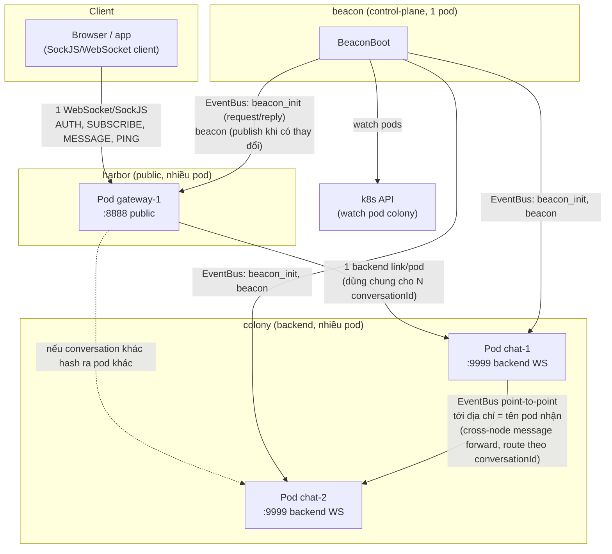
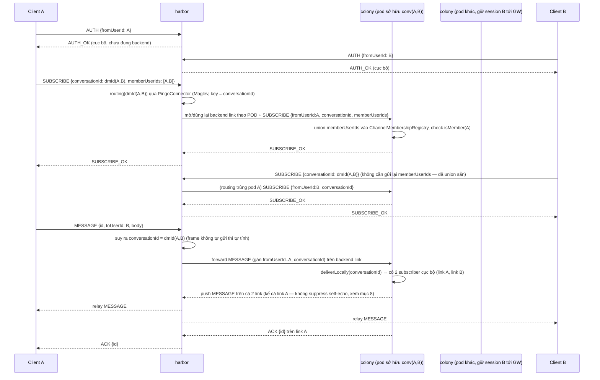
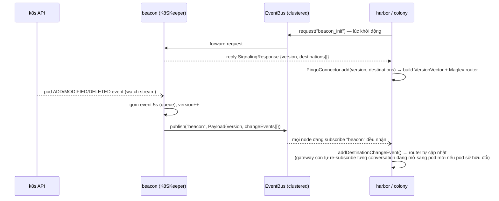

# Kiến trúc hệ thống Pingo Chat

Tài liệu này mô tả tổng thể kiến trúc, luồng dữ liệu, và các quyết định thiết kế của hệ thống chat
gồm 4 module: `discovery`, `beacon`, `harbor`, `colony`.

## 1. Tổng quan

- Toàn bộ service viết trên **Vert.x**, giao tiếp nội bộ qua **EventBus** đã clustering bằng
  **Hazelcast** (mọi node trong cùng 1 cluster thấy chung 1 EventBus logic).
- Routing tin nhắn tới đúng backend node dùng **consistent hashing (thuật toán Maglev)** dựa trên
  `conversationId` (KHÔNG phải `userId`) — 1-1 (DM) và group chat dùng chung 1 model: DM chỉ là 1
  conversation 2 thành viên, `conversationId` tính tất định từ cặp userId (xem mục 3, 11). Khi số
  lượng pod colony thay đổi, chỉ một phần nhỏ conversation bị "route lại", không phải toàn bộ.
- `beacon` là control-plane: theo dõi pod colony nào đang sống, phát (gossip) danh sách đó
  cho `harbor` và `colony`.
- `harbor` là cửa ngõ public (client kết nối vào qua SockJS/WebSocket), không giữ trạng
  thái chat — chỉ relay. Với mỗi pod colony đang sở hữu ít nhất 1 conversation mà client của nó
  quan tâm, giữ **1 backend link dùng chung** cho mọi conversation nào hash ra pod đó (không phải
  1 link/session như thiết kế ban đầu).
- `colony` là nơi thật sự giữ subscriber (không phải "session theo user") của từng conversation và
  deliver tin nhắn cho đúng subscriber cục bộ, hoặc forward sang đúng pod đang sở hữu conversation đó.
- `discovery` là thư viện dùng chung (routing, versioning, connector) — không phải service độc lập,
  không có `main()`.



## 2. Vai trò từng module

| Module | Có `main()`? | Vai trò |
|---|---|---|
| `discovery` | Không (thư viện) | `PingoConnector`/`VersionVector`/`Router` (Maglev) — client-side: tra routing table biết `conversationId` thuộc pod nào, gửi tin nhắn cross-node qua EventBus. `Router`/`Maglev`/`VersionVector` hoàn toàn generic (route theo `RoutingKey.hash()`, không biết gì về userId/conversationId) — sự khác biệt nằm ở `RouteByUserIdRequest`/`RouteByConversationIdRequest`, 2 implementation cụ thể của `RoutingKey`. Định nghĩa chung `SocketFrame`-adjacent DTO cho gossip (`Payload`, `SignalingResponse`), `Destination`, `Keeper` (snapshot). |
| `beacon` | Có | Control-plane duy nhất nói chuyện trực tiếp với **k8s API** (`K8SKeeper`, watch pod colony theo label `app=colony`). Gossip danh sách destination qua EventBus (`RoutingGossipPublisher`). Không đụng gì tới việc đổi routing key sang `conversationId` — chỉ gossip topology pod (ADD/REMOVE), không biết gì về conversation. Chạy local (không k8s) thì dùng `LocalKeeper` với 1 destination cố định. |
| `harbor` | Có | Public-facing. Nhận SockJS/WebSocket từ client thật, xác thực (AUTH, chỉ xử lý cục bộ) rồi, khi client SUBSCRIBE 1 `conversationId`, mở (hoặc dùng lại) backend link xuống đúng pod colony sở hữu conversation đó, relay frame 2 chiều gần như nguyên vẹn. 1 session có thể giữ nhiều backend link (1 link/pod), tuỳ số conversation đang mở nằm rải trên bao nhiêu pod khác nhau. |
| `colony` | Có | Nhận MESSAGE, deliver thẳng nếu conversation có subscriber cục bộ, hoặc forward qua EventBus sang đúng pod đang sở hữu conversation đó (theo Maglev hash của `conversationId`). **Không kết nối trực tiếp với browser** — 1 "subscriber" nó giữ cho 1 conversation thực chất là 1 link WebSocket từ chính harbor (đăng ký lúc SUBSCRIBE), port 9999 không public ra ngoài. |

## 3. Giao thức `SocketFrame`

Toàn bộ giao tiếp (client↔gateway, gateway↔chat) dùng chung 1 envelope JSON:

```json
{
  "type": "AUTH | AUTH_OK | AUTH_ERROR | SUBSCRIBE | SUBSCRIBE_OK | SUBSCRIBE_ERROR | MESSAGE | ACK | ERROR | PING | PONG",
  "id": "correlation id — client tự sinh, server echo lại trong ACK/ERROR/SUBSCRIBE_OK/SUBSCRIBE_ERROR",
  "fromUserId": "sender — server tự gán khi xử lý MESSAGE, không tin giá trị client gửi lên",
  "toUserId": "recipient — CHỈ còn mang tính tiện lợi cho client (DM), KHÔNG dùng để route",
  "conversationId": "id conversation (DM hoặc group) — routing key thật sự, bắt buộc với MESSAGE/SUBSCRIBE",
  "memberUserIds": "chỉ có ý nghĩa với SUBSCRIBE — danh sách userId cần union vào membership (lazy-create/join)",
  "body": "payload tuỳ ý",
  "reason": "lý do lỗi — chỉ có ở ERROR/AUTH_ERROR/SUBSCRIBE_ERROR",
  "ts": "epoch millis, server đóng dấu"
}
```

Gửi dạng **TEXT frame** (không phải binary) — bắt buộc, vì browser/JS `WebSocket` mặc định trả
`event.data` là `Blob` cho binary frame, `JSON.parse()` sẽ lỗi ngay (xem
`harbor/.../session/SockjsSocket.java`).

**`AUTH` tách hẳn khỏi việc mở kết nối backend** (khác thiết kế ban đầu): giờ chỉ xác định danh
tính (`userId`) cho session, xử lý 100% cục bộ tại `harbor`, không đụng gì tới `colony`. `SUBSCRIBE`
mới là handshake thật sự mở/dùng lại backend link — xem mục 4, 11.

Với DM, client vẫn có thể chỉ gửi `toUserId` (không tự tính `conversationId`) — `harbor` tự suy ra
bằng hàm dùng chung `ConversationIds.dmId(fromUserId, toUserId)` (`core/commons-lang`, XOR 2 nửa
UUID, đối xứng — `dmId(A,B) == dmId(B,A)`).

## 4. Luồng AUTH + SUBSCRIBE + gửi tin nhắn (2 user khác pod colony)

**Lưu ý quan trọng**: `colony` không bao giờ giữ kết nối trực tiếp tới browser. Client luôn
chỉ nói chuyện với `harbor` qua SockJS; 1 "subscriber" mà `colony` giữ cho 1 conversation chính là
link WebSocket từ gateway (đăng ký lúc SUBSCRIBE). Vì vậy khi B nhận được tin nhắn, đường đi luôn
phải vòng lại qua đúng gateway đang giữ kết nối SockJS thật của B — dưới đây giả định A và B đang ở
cùng 1 gateway để sơ đồ gọn, nhưng về nguyên tắc mỗi client có thể ở 1 pod gateway khác nhau (gateway
không giữ trạng thái nên không quan trọng client nối vào pod gateway nào).

**Client PHẢI chủ động SUBSCRIBE trước khi có thể NHẬN tin nhắn của 1 conversation** — kể cả DM.
Đây là khác biệt hành vi lớn nhất so với thiết kế cũ (trước đây AUTH xong là tự động "online" nhận
được mọi tin gửi tới `toUserId` mình): giờ mỗi session phải đăng ký quan tâm (subscribe) rõ ràng
từng conversation, giống mô hình "join channel" hơn là "always-on theo userId".



**Điểm mấu chốt cho cross-node delivery đúng**: mỗi pod colony lắng nghe EventBus trên
địa chỉ = **chính định danh của nó** (`serverId` — tên pod k8s, hoặc giá trị fallback khi chạy local
dev), KHÔNG dùng chung 1 địa chỉ tĩnh cho mọi pod. Nếu dùng chung địa chỉ, EventBus sẽ round-robin
tin nhắn tới bất kỳ pod nào đang lắng nghe chứ không phải đúng pod sở hữu conversation.

## 5. Luồng đồng bộ routing table (beacon → gateway/chat)



`beacon` tự chọn giữa 2 chế độ lúc khởi động (`BeaconAppModule`):
- Có biến môi trường `KUBERNETES_SERVICE_HOST` (kubelet luôn tự set khi chạy trong pod k8s) →
  dùng `K8SKeeper`, watch thật qua k8s API.
- Không có → dùng `LocalKeeper`, 1 destination cố định `eb_gossip_adm @ 127.0.0.1` (chạy local dev,
  không cần k8s).

`beacon` hoàn toàn không đổi bởi việc chuyển routing key sang `conversationId` — nó chỉ gossip
topology pod, không biết gì về conversation/user.

## 6. Cấu trúc package `ws/` (harbor & colony)

Cả 2 module tổ chức package theo cùng 1 quy ước để đọc là hiểu ngay vai trò:

```
harbor/ws/              colony/ws/
  dto/                              dto/
    MessageType                       MessageType
    SocketFrame                       SocketFrame
    SocketFrames   (frame builder)
  session/                          session/
    SockjsSocket   (1 client conn,     ChatSession      (1 backend conn,
     giữ nhiều BackendLink theo pod)    biết N conversationId đang subscribe)
    BackendLink    (1 link/pod,        MessageChatSocket (interface)
     dùng chung cho N conversation)    SessionRegistry  (tra cứu theo user id
    MessageSocket  (interface)          VÀ theo conversationId)
  backend/                          delivery/
    BackendLinkGateway                 MessageDelivery
    (subscribe/sendMessage/            (deliver local / forward EventBus,
     reconnect theo conversationId,     route theo conversationId)
     đa-pod cho 1 session)            membership/
  routing/                            ChannelMembershipRegistry
    RoutingVersionSync                 (in-memory, ai thuộc conversation nào)
    (đồng bộ version + re-subscribe   routing/
     từng (session,conversationId)     RoutingVersionSync
     đang mở khi pod sở hữu đổi)       (đồng bộ version, không cần di chuyển
                                        gì — chat không chủ động dial ra)
  SockjsSocketManager (cửa trước)   ChatSessionManager (cửa trước)
  SockjsSocketServer  (verticle)    ChatSocketServer   (verticle)
```

- **`dto`** — định dạng frame trên dây (wire format).
- **`session`** — biểu diễn 1 connection đang sống + tra cứu.
- **`backend`/`delivery`** — quyết định tin nhắn phải đi đâu và đưa nó đi.
- **`membership`** (mới, chỉ colony) — ai thuộc conversation nào, in-memory theo từng pod (xem mục 8, 11).
- **`routing`** — biết pod nào đang sở hữu conversation nào (dựa trên gossip từ beacon).
- File ở gốc package (`*Manager`, `*Server`) — nơi ráp mọi thứ lại, là "cửa trước" nhận connection
  và dispatch protocol.

## 7. Chạy local (không cần k8s)

Cả 3 service (`beacon`, `colony`, `harbor`) chạy độc lập trên cùng máy, tự ghép
cụm Hazelcast qua multicast (không cần cấu hình thêm):

```bash
mvn -pl beacon exec:java -Dexec.mainClass=com.lego.beacon.BeaconBoot
mvn -pl colony exec:java -Dexec.mainClass=com.lego.colony.ColonyBoot
mvn -pl harbor exec:java -Dexec.mainClass=com.lego.harbor.HarborBoot
```

Client test thủ công: mở `demo.html` (ở root repo) trong browser (SockJS raw-websocket transport
tới `ws://localhost:8888/connect/websocket`, hoặc `ws://localhost:31003/connect/websocket` khi test
qua NodePort của cụm k3s local). Có sẵn UI cho cả 3 bước AUTH → SUBSCRIBE (DM/group) → MESSAGE.

**Lưu ý môi trường**: Hazelcast local mặc định dùng multicast + tên cluster `"dev"` (không cách ly)
— nếu chạy nhiều lần/nhiều máy trên cùng mạng có thể thấy member lạ join rồi rớt ngay trong log,
không ảnh hưởng chức năng nhưng dễ gây nhầm khi debug.

## 8. Các quyết định/giới hạn đáng lưu ý

- **Auth chưa có credential thật** — AUTH hiện chỉ tin `fromUserId` client tự khai, chưa verify bằng
  token/JWT. Phù hợp cho prototype, cần bổ sung nếu lên production thật.
- **ACK chỉ ở mức transport** — `ACK` nghĩa là "gateway/chat đã nhận và chuyển tiếp thành công",
  KHÔNG đảm bảo mọi subscriber thực sự nhận được (không có ack 2 chiều xuyên node).
- **Không suppress self-echo** — `MessageDelivery.deliverLocally` fan-out cho MỌI subscriber cục bộ
  của 1 conversation, kể cả chính người gửi nếu họ cũng đang subscribe (điều này LUÔN đúng với DM,
  vì cả 2 phía đều phải subscribe). Cố tình để vậy — client tự dedupe qua `id` nếu cần, tránh thêm
  1 tầng phức tạp cho lợi ích nhỏ.
- **Không có persistence nào — kể cả lịch sử tin nhắn lẫn membership**. `colony` có sẵn config
  `database` trong `app.yaml`/`LegoConfig1.DbConfig` (trỏ Postgres) nhưng **chưa có dòng code nào
  đọc/dùng tới** — hoàn toàn là config chết. `ChannelMembershipRegistry` (ai thuộc conversation nào)
  chỉ sống in-memory, theo từng pod colony, mất khi pod restart — vá tạm bằng việc `harbor` "nhớ"
  lại `memberUserIds` đã biết cho mỗi conversation (`SockjsSocket.membersByConversation`) và gửi lại
  mỗi lần SUBSCRIBE/reconnect, để pod mới tự khôi phục membership — nhưng nếu MỌI session từng biết
  membership của 1 group đều disconnect trước khi ai đó subscribe lại, group đó "quên sạch" vĩnh
  viễn, không nơi nào còn lưu. Đây là giới hạn đã biết trước, cố tình gác lại (xem mục 11) — có sẵn
  framework JDBC pool/SQL executor dùng được ngay trong `core/commons-lang/.../jdbcpool`,
  `.../sql`, chỉ chưa wire vào `colony`.
- **Heartbeat**: gateway↔client và gateway↔backend đều có PING/PONG riêng — phía backend giờ theo
  từng `BackendLink` (không phải theo session), session/link không phản hồi trong ~60s bị coi là
  chết và dọn dẹp.
- **DTO lặp có chủ đích**: `MessageType`/`SocketFrame` (envelope tầng ws) cố tình duplicate giữa
  `colony` và `harbor` thay vì gộp lên `discovery` — giữ 2 module độc lập nhau ở tầng
  giao thức chat, dù cùng chung định dạng. Ngược lại, `Payload`/`SignalingResponse`/`Destination`/...
  (tầng gossip/routing) đã được gộp về `discovery`, dùng chung thật sự. **Ngoại lệ duy nhất**:
  `ConversationIds.dmId(...)` (`core/commons-lang`) dùng chung thật giữa harbor và (gián tiếp) mọi
  nơi cần tính `conversationId` của DM — vì đây là 1 thuật toán 2 phía bắt buộc phải khớp
  bit-for-bit, không phải 1 DTO tầng wire.

## 9. Vì sao không route tin nhắn qua Kafka

Một lựa chọn thay thế "hiển nhiên" cho việc route tin nhắn cross-node là dùng Kafka: mỗi conversation
(hoặc mỗi pod colony) là 1 partition/topic, `harbor` publish MESSAGE vào topic, pod colony đang sở
hữu conversation đó consume rồi đẩy tiếp. Hệ thống hiện tại **cố tình không đi hướng đó** — dùng
consistent hashing (Maglev) để tự tính toán đúng pod cần gửi tới, rồi gửi thẳng qua EventBus
point-to-point (`connector.send(version, request)` — xem `MessageDelivery.send`). Lý do và đánh đổi:

| | **EventBus + consistent hashing (đang dùng)** | **Kafka (partition theo conversation/pod)** |
|---|---|---|
| Độ trễ | 1 hop trực tiếp tới đúng node sở hữu conversation (EventBus clustered qua Hazelcast, cùng datacenter) — cỡ ms | Thêm 1 vòng publish → broker ghi log → consumer poll — thường chậm hơn hẳn, dù vẫn nhanh so với batch xử lý thông thường |
| Hạ tầng vận hành | Không thêm service nào — EventBus có sẵn trong Vert.x, chỉ cần Hazelcast (đã dùng để cluster) | Phải tự vận hành thêm 1 cụm Kafka (+ZooKeeper/KRaft) — chi phí ops không nhỏ cho 1 hệ thống chat |
| Rebalance khi scale | Maglev: đổi node chỉ khiến ~1/N conversation bị route lại (`VersionVector`/`Router`), mượt, không cần điều phối trung tâm | Kafka partition reassignment tương đối nặng, số partition thường là hằng số cấu hình sẵn — khó co giãn mượt theo số pod colony |
| Durability / replay | Không — nếu node sở hữu chết đúng lúc message đang bay thì mất (không có log, không retry lại được); hiện KHÔNG có bất kỳ lưu trữ nào khác bù lại (xem mục 8) | Có — Kafka giữ log, consumer group mới có thể replay lại toàn bộ lịch sử |
| Fan-out cho consumer khác | Không hỗ trợ — chỉ đúng 1 pod nhận đúng 1 message (rồi tự fan-out cho subscriber cục bộ của nó) | Nhiều consumer group độc lập cùng đọc được 1 topic (vd thêm service notification/analytics sau này rất dễ) |
| Back-pressure | Không có buffer tự nhiên — 1 node bị dồn tin nhắn dồn dập thì dồn thẳng vào EventBus, dễ nghẽn nếu node đó chậm | Partition tự nhiên đóng vai trò buffer, consumer đọc theo tốc độ riêng của nó |

**Vì sao vẫn chọn EventBus + consistent hashing**: mục tiêu của `colony`/`harbor` là **đường đi
real-time, độ trễ thấp** cho tin nhắn đang "bay" giữa những người dùng online cùng lúc — không phải
là nơi lưu trữ lâu dài. Kafka giải quyết đúng vấn đề "durable log + nhiều consumer group + replay",
nhưng đó không phải bài toán ở đây — dùng Kafka cho phần này là trả thêm chi phí độ trễ + vận hành
cho một khả năng (durability, replay) mà tầng transport-tạm-thời này không cần **nếu** có 1 tầng lưu
trữ khác đảm nhiệm việc đó (hiện CHƯA có — xem mục 8). Đánh đổi phải chấp nhận: **không có
persistence ở tầng này** — một tin nhắn có thể mất nếu đúng lúc node đích chết (hiện `ACK` chỉ xác
nhận "gateway/chat đã chuyển tiếp", không xác nhận subscriber thực sự nhận — xem mục 8), và route
table là *eventually consistent* qua gossip chứ không có 1 broker trung tâm làm trọng tài — đây
chính là nguồn gốc của race condition mô tả ở mục 10 dưới đây. Nếu sau này cần thêm nhiều consumer
độc lập (notification service, audit log...) hoặc cần đảm bảo delivery mạnh hơn (at-least-once có
replay), đó sẽ là lúc đáng cân nhắc thêm Kafka cho riêng luồng đó — không nhất thiết phải thay cả
hệ thống.

## 10. Race condition khi routing table đổi version — vấn đề và cách đã fix

### `VersionVector` tồn tại để làm gì

`VersionVector` (`discovery/.../versionvector/VersionVector.java`) không chỉ là 1 con số tăng dần —
nó giữ **nhiều bản routing table cũ cùng lúc** (mặc định tối đa `MAX_RETAINED_VERSIONS = 50` bản gần
nhất), không chỉ đúng bản mới nhất. Lý do: mỗi khi `beacon` gossip ra 1 thay đổi (pod thêm/bớt),
`colony` cập nhật routing table gần như NGAY (chỉ là update 1 hashtable trong bộ nhớ), nhưng
`harbor` cần **thời gian thật** (network round-trip) để re-subscribe từng conversation đang mở sang
đúng pod colony mới (`BackendLinkGateway.reconnectConversationToVersion`, gọi từ
`RoutingVersionSync.reconnectSessionsToNewVersion` — lặp theo từng cặp `(session, conversationId)`,
không phải theo session, vì 1 session giờ có thể có nhiều conversation nằm trên nhiều pod khác nhau)
— việc này không thể tức thời nếu có hàng nghìn session/conversation. Giữ lại các version cũ cho
phép 1 conversation "đứng" ở version cũ trong lúc đang migrate, thay vì bị mất route ngay khi version
mới nhất xuất hiện.

### Vấn đề cụ thể: bản thân việc giữ nhiều version chưa đủ

Chỉ giữ version cũ không tự động giải quyết vấn đề — vẫn cần *ai đó chủ động dùng* version cũ khi
cần. Nếu code chỉ luôn route theo `currentVersion` mới nhất, xảy ra khoảng hở:

1. `beacon` gossip pod colony X bị xoá, thêm pod Y — routing table nhảy version `N → N+1` gần như
   ngay lập tức trên mọi node.
2. `colony` (nơi tính toán "message này gửi cho conversation thì conversation đó đang ở pod nào") đã
   dùng version `N+1` để tính đích — trỏ sang pod Y.
3. Nhưng `harbor` — nơi thật sự giữ backend link cho conversation đó — CHƯA kịp mở xong link mới sang
   Y (đang giữa quá trình reconnect, mất vài ms tới vài trăm ms tuỳ tải mạng).
4. Message bị forward đúng theo version mới (`N+1`, trỏ sang Y), nhưng Y **chưa có subscriber nào**
   cho conversation đó → tin nhắn bị rơi, chỉ log "no local subscriber on this node"
   (`MessageDelivery.onRoutedMessage`).

Đây chính là câu hỏi gốc đặt ra khi rà lại thiết kế: 2 phía (routing table ở `colony`, subscribe
migration ở `harbor`) đổi trạng thái với **tốc độ khác nhau hẳn** — 1 bên là cập nhật hashtable local
(rất nhanh), 1 bên là I/O mạng thật (chậm hơn nhiều bậc) — và không có gì đồng bộ hoá giữa 2 tốc độ
đó.

### 4 fix đã áp dụng — mỗi fix đóng 1 khe hở khác nhau

1. **Hedge sang version liền trước** (`MessageDelivery.forwardToOwningNode` /
   `hedgeToPreviousVersionIfDifferent`) — khi forward MESSAGE, tính đích theo cả version hiện tại
   **và** version ngay trước đó (dùng `RouteByConversationIdRequest`); nếu 2 pod khác nhau, gửi dự
   phòng sang CẢ HAI. Vế nào không có subscriber cục bộ thì tự bỏ qua (không lỗi), vế còn lại deliver
   bình thường — vá đúng khoảng hở ở bước 3-4 phía trên, ngay tại thời điểm gửi tin.
2. **Gossip REMOVE ngay lập tức, không chờ batch** (`RoutingGossipPublisher.addToQueue`) — trước đây
   mọi thay đổi (cả ADD lẫn REMOVE) đều gộp batch 5 giây rồi mới gossip. Với REMOVE (pod đã chết),
   càng chờ lâu càng nhiều tin nhắn tiếp tục bị route nhầm vào pod không còn tồn tại. Giờ REMOVE
   được publish ngay (`executor.execute`), chỉ ADD (pod mới, chưa ai cần route gấp) mới còn chờ batch
   — thu hẹp cửa sổ mà cả hệ thống còn "chưa biết" pod đã chết.
3. **Không đóng backend link cũ cho tới khi link mới SUBSCRIBE_OK** (`BackendLinkGateway.ensureLinkAndSubscribe`
   / `sendSubscribeAndAwait`) — trước đây (và vẫn giữ nguyên tinh thần sau khi đổi model đa-link) link
   cũ chỉ bị đóng SAU khi nhận được xác nhận từ node mới, KHÔNG phải ngay khi TCP connect() xong.
   Nếu handshake lỗi/timeout, link cũ (nếu có, CÙNG pod) được giữ nguyên hoàn toàn
   (`SockjsSocket.putLink` chỉ đóng link cũ của đúng pod đang thay thế, không đụng link của pod khác).
4. **Harbor "nhớ" lại `memberUserIds` và gửi lại mỗi lần SUBSCRIBE/reconnect** (`SockjsSocket.rememberMembers`/
   `getRememberedMembers`, dùng trong `BackendLinkGateway.reconnectConversationToVersion`) — phát
   hiện qua test thật (không phải suy luận): vì `ChannelMembershipRegistry` chỉ in-memory theo từng
   pod (xem mục 8), khi 1 conversation chuyển sang pod MỚI (pod cũ restart/scale), pod đó hoàn toàn
   không biết membership — nếu harbor không tự gửi lại `memberUserIds` đã biết, SUBSCRIBE sẽ bị từ
   chối ("not a member") **vĩnh viễn**, dù client vẫn hợp lệ. Đã verify bằng test thật: xoá colony
   pod giữa lúc đang chat, gửi 20 tin liên tục trong 40s — trước fix này mất tin từ lúc pod cũ biến
   mất và không bao giờ phục hồi; sau fix, cả 20/20 tin đều tới, kể cả tin gửi ngay sau khi xoá pod.

Cả 4 fix cùng thu hẹp — chứ không loại bỏ tuyệt đối — khoảng hở race condition: (1) và (3) đảm bảo
tại mọi thời điểm luôn có ít nhất 1 phía (version cũ hoặc version mới) có subscriber sống thật sự để
nhận tin; (2) rút ngắn thời gian cả hệ thống "chưa biết" một thay đổi đã xảy ra; (4) đảm bảo việc
re-subscribe sang pod mới không bị chặn bởi thiếu membership. Giới hạn còn lại: môi trường test local
hiện tại khi chạy `LocalKeeper` (1 destination cố định, không qua k8s) không tạo ra ADD/REMOVE thật
nên các nhánh trên chỉ được verify end-to-end bằng test thật khi chạy trên k3s (`K8SKeeper`) — xem
mục 11.

## 11. Chuyển routing từ shard-theo-userId sang shard-theo-conversationId (group chat)

### Vì sao đổi

Thiết kế ban đầu chỉ hỗ trợ chat 1-1: routing (`RouteByUserIdRequest`) và transport (harbor giữ đúng
1 backend link/session) đều theo `userId`. Muốn hỗ trợ group chat mà không tạo 1 code path riêng cho
1-1 vs group, cần hợp nhất cả 2 dưới khái niệm `conversationId` — DM cũng là 1 "conversation" 2
thành viên (so sánh với kiến trúc real-time messaging của Slack: Channel Server sharded theo channel,
Gateway Server subscribe qua đó — DM trong Slack cũng chạy qua đúng hạ tầng channel, không có code
path riêng).

### Quyết định thiết kế

1. **Hash `conversationId` độc lập hoàn toàn** (kể cả DM) — không ghim theo userId của 1 trong 2
   người. Hệ quả: harbor phải hỗ trợ nhiều backend link/session (1 link/pod đích, dùng chung cho N
   conversation cùng pod) thay vì 1 link/session như trước — ảnh hưởng TOÀN BỘ traffic, kể cả DM.
2. **Membership lưu in-memory** — `colony` chưa có kết nối DB thật nào (xem mục 8). Không đấu nối
   Postgres ở lần đổi này; `ChannelMembershipRegistry` mất khi pod restart, vá tạm bằng cơ chế
   "harbor tự nhớ và gửi lại memberUserIds" (mục 10, fix #4).
3. **DM tự suy `conversationId` từ `toUserId`** (`ConversationIds.dmId`, XOR 2 nửa UUID, đối xứng) —
   client vẫn gửi `toUserId` như cũ, không bắt buộc phải tự tính `conversationId`. Group: client tự
   chọn/hardcode `conversationId` — hệ thống chưa có flow "tạo group" thật, nhất quán với việc chưa
   có AuthN thật (mục 8).
4. **`AUTH` tách khỏi việc mở kết nối backend** — chỉ còn xác định danh tính, xử lý cục bộ ở harbor.
   `SUBSCRIBE`/`SUBSCRIBE_OK`/`SUBSCRIBE_ERROR` (frame type mới) mới là handshake mở/dùng lại backend
   link cho 1 `conversationId` cụ thể, đồng thời làm luôn việc lazy-create/join membership (frame
   `SUBSCRIBE` mang kèm `memberUserIds` optional).

### Vì sao `discovery` không cần sửa

`RoutingKey` là interface `int hash()` hoàn toàn generic — không hardcode String/UUID.
`ConsistentRouter`/`Maglev`/`VersionVector`/`PingoConnector` không tham chiếu `userId` ở đâu cả; chỉ
`RouteByUserIdRequest` (1 implementation cụ thể) mới gắn với userId. Vì vậy chỉ cần THÊM
`RouteByConversationIdRequest` (mirror y hệt, đổi `userId` → `conversationId`, dùng lại
`UUIDsHashHelper.hash(UUID)` có sẵn) — không sửa gì trong lõi `discovery`.

### Kết quả xác nhận (test thật qua WebSocket trên k3s, không phải mock)

- DM 2 chiều, group chat (lazy-join qua SUBSCRIBE), non-member bị từ chối subscribe: đều pass.
- Resilience: xoá colony pod giữa lúc đang chat, gửi liên tục 20 tin trong 40s — 20/20 tin đều tới,
  không rớt tin nào kể cả ngay sau khi pod bị xoá (nhờ đúng 4 fix ở mục 10, đặc biệt fix #4 — phát
  hiện qua chính lần test này, không có nó thì B mất tin vĩnh viễn từ lúc colony pod cũ biến mất).

### Giới hạn còn lại sau khi đổi (so với 1 hệ real-time messaging đầy đủ như Slack)

- **Không có lịch sử tin nhắn** — Slack's Channel Server giữ channel history; `colony` không lưu gì
  cả, subscribe vào 1 group không nhận được tin cũ.
- **Membership không bền** — patch bằng "harbor tự nhớ" (mục 10, fix #4) chỉ hoạt động khi còn ít
  nhất 1 session "nhớ" thông tin đó; không có nơi lưu trữ trung tâm thật sự.
- **Không đa vùng, không Presence Server** — chưa có khái niệm vùng địa lý trong `harbor`, chưa track
  online/offline.

Đây là những khoảng gác lại có chủ đích (xem mục 8, 9) — không phải thiếu sót của lần đổi này, mà là
việc chưa cần làm cho mục tiêu hiện tại (prototype/MVP), biết trước sẽ cần khi lên production thật.
