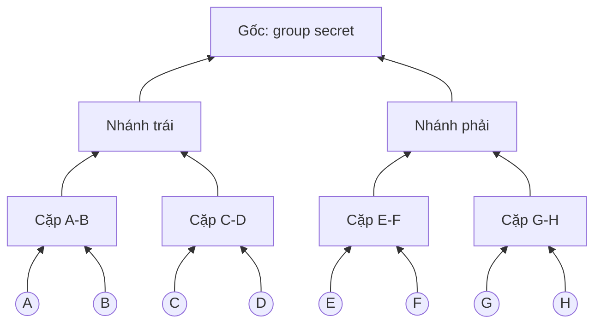
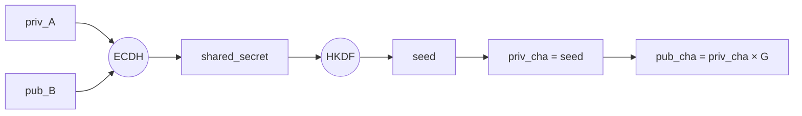
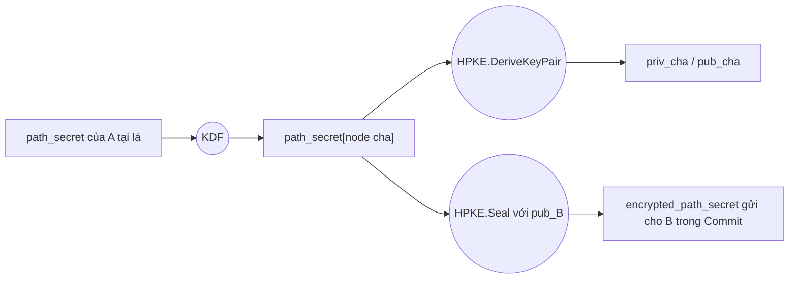
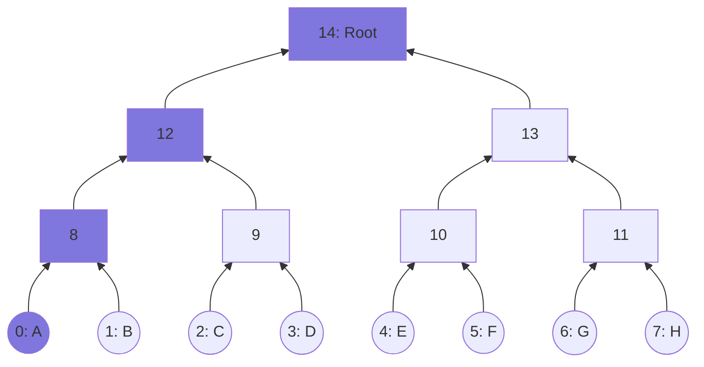
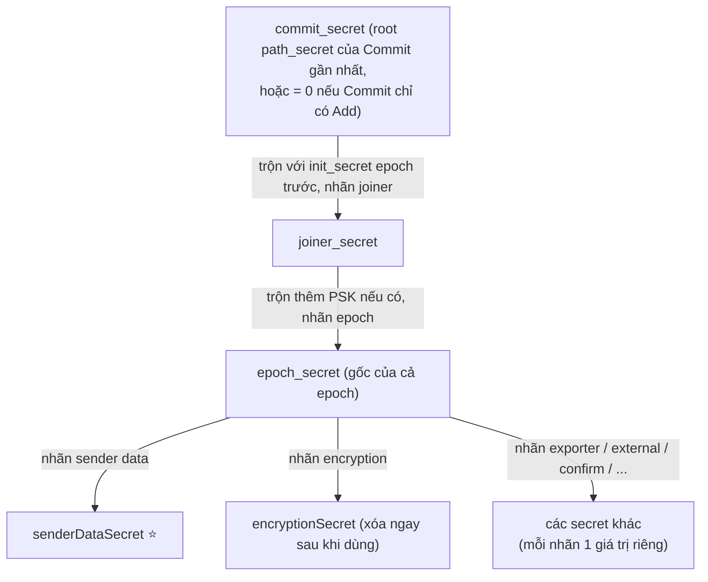

# Diffie-Hellman: Cơ chế trao đổi khóa chung an toàn

## 1. Giới thiệu

Diffie-Hellman (DH) là thuật toán trao đổi khóa (key exchange), được Whitfield Diffie và Martin Hellman công bố năm 1976. Đây là nền tảng cho phần lớn các hệ thống mã hóa đầu-cuối (E2EE) hiện nay, bao gồm TLS, Signal Protocol và MLS.

**Vấn đề DH giải quyết:** hai bên muốn thống nhất một khóa bí mật chung để mã hóa dữ liệu, nhưng chỉ có thể liên lạc qua một kênh không an toàn — ai cũng có thể nghe lén được. Trước DH, cách duy nhất là trao đổi khóa trực tiếp (gặp mặt, chuyển phát an toàn...), bất tiện và không khả thi ở quy mô internet. DH cho phép hai bên đạt được một khóa bí mật chung mà **không cần gửi khóa đó qua mạng ở bất kỳ thời điểm nào**.

## 2. Minh họa bằng phép cộng

Để hình dung cơ chế, dùng phép cộng thay cho toán học thật sự phức tạp phía sau:

- Số công khai (ai cũng thấy): **10**
- Alice có số bí mật riêng: **3**
- Bob có số bí mật riêng: **7**

**Bước 1 — mỗi người tự cộng thêm bí mật của mình vào số công khai, rồi gửi kết quả cho nhau:**

| Người | Phép tính | Gửi đi |
| --- | --- | --- |
| Alice | 10 + 3 = 13 | 13 |
| Bob | 10 + 7 = 17 | 17 |

**Bước 2 — mỗi người cộng thêm bí mật của mình vào số vừa nhận được:**

| Người | Nhận được | Phép tính | Kết quả |
| --- | --- | --- | --- |
| Alice | 17 (từ Bob) | 17 + 3 | 20 |
| Bob | 13 (từ Alice) | 13 + 7 | 20 |

Cả hai ra cùng kết quả **20** — đây là khóa chung — dù không ai gửi thẳng số bí mật (3 hoặc 7) của mình đi. Bí quyết nằm ở tính chất: (10 + 3) + 7 = (10 + 7) + 3, nên dù cộng bí mật vào trước hay sau, kết quả cuối vẫn giống nhau.

## 3. Vì sao phép cộng không an toàn trong thực tế

Phép cộng chỉ giúp minh họa cơ chế "hai bên tự thêm bí mật vào sau vẫn ra cùng kết quả" — nhưng nếu Diffie-Hellman thật sự dùng phép cộng, hệ thống sẽ vô dụng.

Một kẻ nghe lén thấy được toàn bộ dữ liệu trao đổi công khai: 10, 13, 17. Với phép cộng, việc tính ngược cực kỳ đơn giản:

- 13 − 10 = 3 → lộ ngay số bí mật của Alice
- 17 − 10 = 7 → lộ ngay số bí mật của Bob

Vấn đề cốt lõi: phép cộng có **tính xuôi và tính ngược dễ như nhau** (cộng thì dễ, trừ để tìm lại cũng dễ không kém). Một hệ mã hóa an toàn cần một phép toán mà **tính xuôi dễ nhưng tính ngược gần như bất khả thi** — đó là lý do DH thật sự dùng phép lũy thừa modulo thay vì phép cộng.

## 4. Diffie-Hellman thực tế: lũy thừa modulo

DH thật sự thay phép cộng bằng phép **lũy thừa rồi lấy phần dư (modulo)** — công thức `g^x mod p`, với `g` (số sinh) và `p` (số nguyên tố lớn) là hai số công khai.

| Bước | Alice | Bob |
| --- | --- | --- |
| Thống nhất công khai | g = 5, p = 23 | g = 5, p = 23 |
| Chọn số bí mật | a = 6 | b = 15 |
| Tính và gửi đi | A = 5^6 mod 23 = 8 | B = 5^15 mod 23 = 19 |
| Nhận và tính khóa chung | 19^6 mod 23 = 2 | 8^15 mod 23 = 2 |

Cả hai ra cùng khóa chung **2**, nhờ tính chất toán học (g^a)^b mod p = (g^b)^a mod p.

**Vì sao an toàn:** kẻ nghe lén thấy được g, p, A, B nhưng để tìm lại số bí mật a hoặc b, phải giải bài toán **logarit rời rạc** (discrete logarithm) — tính xuôi (lũy thừa modulo) rất nhanh, nhưng tính ngược gần như bất khả thi khi p là số nguyên tố hàng trăm chữ số. Đây chính là phép toán "khó đảo ngược" thay thế cho phép cộng trong ví dụ minh họa.

**ECDH (Elliptic Curve Diffie-Hellman):** biến thể dùng đường cong elliptic thay vì số nguyên tố lớn, cho khóa ngắn hơn nhiều (256-bit ECC ≈ an toàn tương đương 3072-bit DH gốc) nhưng tính toán nhanh hơn — đây là dạng DH được dùng phổ biến nhất trong các hệ thống hiện đại.

## 5. Ứng dụng trong E2EE

Sau khi có khóa chung từ ECDH, hệ thống E2EE không dùng khóa đó để mã hóa trực tiếp mà qua thêm hai bước:

1. **HKDF** — dẫn xuất khóa chung thô thành một khóa mã hóa an toàn hơn về mặt thống kê
2. **AES-GCM** (hoặc ChaCha20-Poly1305) — dùng khóa đã dẫn xuất để mã hóa nội dung tin nhắn thực tế, đồng thời xác thực tính toàn vẹn

Lý do kết hợp hai loại mã hóa (mô hình **hybrid encryption**): mã hóa bất đối xứng như DH/ECDH rất chậm và chỉ phù hợp trao đổi khóa; mã hóa đối xứng như AES nhanh hơn hàng nghìn lần, phù hợp mã hóa dữ liệu lớn.

**MLS (Messaging Layer Security)** — giao thức E2EE cho nhóm chat lớn (Google Messages, Cisco Webex) — mở rộng ý tưởng này bằng cấu trúc **TreeKEM**: thay vì làm ECDH riêng lẻ giữa từng cặp thành viên (rất tốn kém với nhóm lớn), TreeKEM tổ chức các phép ECDH theo một cây nhị phân, giúp cả nhóm hàng nghìn người vẫn đạt được một "group secret" chung chỉ với O(log n) thao tác thay vì O(n²).

Mỗi khi có thành viên vào hoặc rời nhóm, group secret được làm mới hoàn toàn (gọi là một epoch mới), đảm bảo:

- **Forward secrecy** — thành viên cũ rời nhóm không đọc được tin nhắn mới
- **Post-compromise security** — nếu một thiết bị bị lộ khóa, tin nhắn sau đó (từ epoch mới) vẫn an toàn

### Ví dụ dễ hiểu: DH nằm ở đâu trong cây MLS

Hình dung nhóm 8 người xếp thành sơ đồ **cây gia phả** (cây nhị phân):

Mỗi mũi tên đi lên trong sơ đồ này chính là **một phép ECDH (Diffie-Hellman) thực thụ**:

- **Khóa của Cặp A-B** = ECDH(private key của A, public key của B) — hoặc ECDH(private key của B, public key của A). Cả hai cách tính đều ra cùng kết quả, đúng nguyên lý DH ở phần trước.
- **Khóa của Nhánh trái** = ECDH(khóa dẫn xuất của cặp A-B, khóa dẫn xuất của cặp C-D) — lặp lại đúng một phép DH, chỉ khác đầu vào giờ là khóa của tầng dưới chứ không phải khóa gốc từng người.
- Lặp lại như vậy tới đỉnh cây → **khóa gốc (group secret)** là kết quả của nhiều phép DH nối tiếp nhau theo tầng, không phải một phép DH duy nhất giữa 2 người.

**Điều hay nhất:** mỗi thành viên không cần biết khóa riêng của ai khác — chỉ cần biết khóa công khai của những người dọc theo đường đi từ mình lên đỉnh (gọi là copath), rồi tự trộn dần lên là ra được bí mật chung.

**Số phép DH cần dùng — ví dụ nhóm 8 người:**

|  | Số phép DH |
| --- | --- |
| Dựng toàn bộ cây (một lần) | 7 (bằng số node cha: 4 cặp + 2 nhánh + 1 gốc) |
| Một thành viên tự tính lại khóa gốc từ khóa lá của mình | 3 (bằng chiều cao cây, log₂8) |
| Ghép cặp trực tiếp kiểu Signal (mọi người với mọi người) | 28 (mọi cặp trong nhóm 8 người) |

Nhóm càng đông, chênh lệch càng lớn: nhóm 10.000 người, ghép cặp kiểu Signal cần khoảng 50 triệu phép DH, còn TreeKEM chỉ cần khoảng 10.000 — đây là lý do MLS dùng cấu trúc cây thay vì bắt tay từng cặp.

### Node cha được tính giá trị như thế nào

Khi hai node con "chụm" lại thành một node cha, node cha đó **không chỉ có một giá trị đơn** — nó có hẳn một cặp khóa (private + public) riêng, giống hệt cấu trúc của một node lá.

Có **2 mô hình khác nhau** để tính ra cặp khóa đó — dễ nhầm lẫn vì nhiều tài liệu/bài giảng phổ biến vẫn dạy theo mô hình cũ (1), trong khi MLS chuẩn hiện hành dùng mô hình (2):

#### (1) Mô hình học thuật gốc — TreeKEM 2018 (dễ hình dung, nhưng KHÔNG phải cách MLS chuẩn dùng)

Đây là thiết kế TreeKEM nguyên bản, dùng để minh họa trực giác "hai node con tự chụm lại":

1. **Tính shared secret bằng ECDH** giữa 2 node con: `shared_secret = ECDH(private key của A, public key của B)` (= ECDH(private key của B, public key của A), hai bên ra cùng kết quả)
2. **Đưa shared secret qua HKDF** để "làm sạch" thành một chuỗi bit ngẫu nhiên đều: `seed = HKDF(shared_secret)`
3. **Dùng seed đó làm private key mới cho node cha:** `private key của node cha = seed`
4. **Tính public key của node cha** từ private key đó, theo cách tính chuẩn (nhân với điểm sinh G trên đường cong elliptic): `public key của node cha = private_key_cha × G`

Trực giác dễ hiểu: node cha là "kết hợp" của 2 node con, y hệt cách 2 node lá thống nhất khóa chung ở phần 4. Nhưng đây **không phải cách RFC 9420 (chuẩn MLS hiện hành) thực sự vận hành** — xem mô hình (2).

#### (2) RFC 9420 thực tế — cách MLS chuẩn (và dự án này, qua thư viện `ts-mls`) hoạt động

Khác biệt cốt lõi: node cha **không được tính bằng cách "kết hợp 2 node con"**. Thay vào đó, chỉ **một người duy nhất** (người đang thực hiện Commit, gọi là A) tự sinh toàn bộ bí mật cho cả direct path, rồi **gửi (mã hóa) bí mật đó** cho các thành viên khác cần biết — chứ họ không tự "chụm" hai bên lại với nhau.

1. A tự sinh **một secret ngẫu nhiên duy nhất** tại lá của mình: `path_secret[0]`.
2. A tự suy ra chuỗi bí mật cho từng node cha dọc direct path bằng **hash chain thuần túy**, không liên quan gì tới public key của sibling: `path_secret[n] = KDF(path_secret[n-1])`.
3. Từ mỗi `path_secret[n]`, dùng hàm `DeriveKeyPair` của HPKE để ra cặp khóa (private/public) cho node đó: `(priv_n, pub_n) = HPKE.DeriveKeyPair(path_secret[n])`.
4. Để những thành viên khác (ví dụ B, nằm trong nhánh mà A cần "báo" bí mật mới) nhận được `path_secret[n]` tương ứng, A **mã hóa nó bằng HPKE Encrypt** với public key hiện có của B (lấy từ ratchet tree đang lưu) rồi gửi kèm trong Commit — bản thân HPKE bên trong có dùng một phép ECDH tạm thời, nhưng đó là để **mã hóa/gửi bí mật cho đúng người**, không phải để "kết hợp khóa 2 node con".
5. B giải mã ra đúng `path_secret[n]`, rồi tự chạy lại đúng chuỗi hash ở bước 2 để tính tiếp các node cao hơn — ra kết quả giống hệt A.

**Vì sao khác nhau lại quan trọng:** field `parentHash` mà cây MLS thật (kể cả `ts-mls` trong dự án này) lưu ở mỗi node cha chỉ có ý nghĩa trong mô hình (2) — nó dùng để xác thực rằng node cha được tạo ra đúng từ một `path_secret` hợp lệ của một Commit thật, chứ không tồn tại khái niệm này trong mô hình combine-DH (1). Mô hình (1) từng là thiết kế TreeKEM ban đầu nhưng sau đó được thay bằng mô hình (2) vì lý do bảo mật khi phân tích kỹ hơn.

Dù theo mô hình nào, node cha (sau khi đã có key) đóng vai trò y như một node lá ở tầng dưới nó khi tính tiếp lên tầng cao hơn, cứ thế lặp lại cho tới gốc.

### Copath: A tự tìm đường lên gốc bằng cách nào

Cây MLS dùng cấu trúc **left-balanced binary tree**, mỗi node có một chỉ số (index) cố định, tính được bằng công thức toán học — không cần dò tìm. Với cây 8 lá:

*Các node tô màu là direct path của A — đường A tự tính lên gốc.*

Lá của A = index cố định (ví dụ A ở lá số 0). **Đường đi lên gốc (direct path)** của A = 0 → 8 → 12 → 14, tính ngay bằng công thức dựa trên index, không cần duyệt cây.

**A cần lấy public key ở đâu để tính?**

Không phải toàn bộ cây — A chỉ cần public key của các "anh em" (sibling) dọc đường đi lên, gọi là **copath**: node 1, node 9, node 13. Điều này **đúng ở cả 2 mô hình** đã nêu ở mục trước, nhưng vai trò của các public key này khác nhau:

- **Theo mô hình học thuật gốc (1):** A tự dùng trực tiếp các public key đó để combine bằng ECDH:
  - Tính node 8 (cha của A): node 8 = ECDH(priv\_A, pub\_B)
  - Tính node 12: node 12 = ECDH(priv\_node8, pub\_node9)
  - Tính node 14 (gốc): node 14 = ECDH(priv\_node12, pub\_node13)

- **Theo RFC 9420 thực tế (2) — cách MLS chuẩn/`ts-mls` dùng:** A **không** combine gì với các public key này để *tạo ra* khóa node cha (khóa node cha đã được A tự suy ra sẵn từ `path_secret` của chính mình, như mục trước). Public key của node 1, node 9, node 13 chỉ được dùng làm **địa chỉ để mã hóa (HPKE Encrypt)** — A mã hóa đúng `path_secret[n]` tương ứng bằng từng public key này rồi gửi kèm trong Commit, để đúng người sở hữu private key đó (B, hoặc hậu duệ của node 9/13) giải mã được và tự tính tiếp.

→ Copath của A = {node 1, node 9, node 13} — chỉ 3 public key, bằng chiều cao cây (log₂8), không phải toàn bộ cây. Số lượng cần biết giống nhau ở cả 2 mô hình, chỉ khác cách dùng (combine vs. mã hóa-gửi).

**Những public key này lấy từ đâu?**

Mỗi thành viên MLS lưu sẵn một bản sao đầy đủ cấu trúc cây, gọi là **ratchet tree** — chứa toàn bộ public key của mọi node, được đồng bộ lại mỗi khi có Commit. A không cần "hỏi" ai theo thời gian thực, chỉ cần:

1. Biết index của lá mình (cố định, biết trước)
2. Tính ra copath bằng công thức index (không cần duyệt tìm)
3. Tra cứu public key của các node trong copath từ bản sao ratchet tree đang lưu local
4. Tự chạy chuỗi ECDH liên tiếp từ private key lá của mình lên tới gốc

### A tự đổi khóa: quy trình Commit

Mục trước đã nói A có thể tự tạo private key mới cho lá của mình. Khi đó, toàn bộ direct path từ A lên gốc phải tính lại — vì mọi node cha dọc đường đó đều phụ thuộc vào khóa của A.

**Các bước cụ thể:**

1. A tạo cặp khóa lá mới: `priv_A', pub_A'` (thay cho `priv_A, pub_A` cũ).
2. A tự tính lại toàn bộ direct path bằng khóa mới của mình + copath cũ (vẫn lấy từ ratchet tree đang có): node 8' = ECDH(priv\_A', pub\_B), node 12' = ECDH(priv\_node8', pub\_node9), node 14' (gốc mới) = ECDH(priv\_node12', pub\_node13).
3. A đóng gói các public key mới (pub\_A', pub\_node8', pub\_node12') thành một thông điệp gọi là **Commit**, mã hóa riêng từng phần cho đúng người cần, rồi gửi (broadcast) cho cả nhóm.

**Các thành viên khác nhận Commit thì làm gì?**

- Thành viên nằm trên copath của A (ví dụ B): nhận trực tiếp giá trị node mới liên quan (đã mã hóa riêng cho họ), tự tính tiếp lên gốc bằng copath còn lại của mình.
- Các thành viên khác (không liên quan trực tiếp): chỉ cần cập nhật (patch) đúng những node đã đổi trong bản sao ratchet tree local — không tính lại gì, không cần tạo lại toàn bộ cây.

**Vậy có cần giữ bản khóa cũ không?** Có, nhưng chỉ tạm thời: MLS gọi mỗi lần group secret đổi là một **epoch** mới. Thiết bị thường giữ private key của một vài epoch gần nhất (epoch hiện tại + epoch ngay trước) để xử lý tin nhắn đến trễ hoặc sai thứ tự, rồi xóa hẳn sau đó — không giữ mãi, vì giữ mãi sẽ phá vỡ forward secrecy.

Commit này chính là cơ chế nền cho cả việc **thêm/xóa thiết bị** (mục tiếp theo) lẫn câu hỏi **root có đổi hay không** (mục sau đó) — cả hai đều dùng đúng quy trình Commit vừa mô tả ở đây.

### Root có giữ nguyên khi A đổi khóa không

**Không — root PHẢI đổi khi A đổi khóa. Đó chính là mục đích thiết kế, không phải lỗi cần khắc phục.**

Ví dụ giải đấu loại trực tiếp: nếu đội A rút lui, cử đội A' vào thay, thì nhà vô địch chắc chắn phải tính lại từ nhánh đó — không có lý do gì "nhà vô địch cũ" giữ nguyên khi một đội tham gia đã đổi. Cây MLS y hệt: A đổi khóa → root đổi theo.

**Vì sao "root đổi" lại là mục tiêu bảo mật, không phải vấn đề:**

- **Forward secrecy** — nếu private key cũ của A từng bị lộ, kẻ tấn công phải không đọc được tin nhắn mới → bắt buộc root phải đổi hẳn, nếu không kẻ tấn công vẫn dùng khóa cũ tính ra group secret y hệt.
- **Post-compromise security** — nếu khóa A đang dùng hiện tại bị lộ, A đổi khóa một lần → root đổi → kẻ tấn công dù đang có khóa cũ cũng không theo kịp group secret mới.

Nếu root không đổi khi A đổi khóa, việc đổi khóa sẽ hoàn toàn vô nghĩa.

**Điều thật sự cần đảm bảo: mọi thành viên tính ra ĐÚNG CÙNG một root mới — không phải root giữ nguyên.**

- A tính lại toàn bộ direct path bằng khóa mới, gửi các public key mới (đã mã hóa đúng người cần) qua Commit.
- Mọi thành viên khác nhận Commit, cập nhật đúng những node bị ảnh hưởng trong bản sao cây của họ.
- Vì công thức ECDH ở mỗi node là **xác định (deterministic)** — cùng input luôn ra cùng output — nên ai cũng tính ra đúng một root mới giống hệt nhau, dù root đó khác hẳn root cũ.

**Tóm gọn:** cái cần "bất biến" không phải giá trị root, mà là **sự đồng thuận** — mọi thành viên phải tính ra cùng một root mới, giống nhau tuyệt đối, mỗi khi có thay đổi. Root luôn được phép (và nên) thay đổi liên tục; điều quan trọng là không ai bị lệch pha so với người khác.

### parentHash: cây tự xác thực lịch sử Commit, và vì sao có node "chưa có hash"

Mỗi node cha trong ratchet tree, ngoài cặp khóa (private/public), còn lưu thêm 1 field gọi là **`parent_hash`** — một hash trỏ lên node cha của chính nó. Mục đích: cho phép các thành viên khác **xác thực** rằng node đó thực sự sinh ra từ một UpdatePath hợp lệ của một Commit thật, không phải bị chèn/giả mạo tùy tiện.

**parentHash không tự động phủ khắp cây — chỉ node nằm trên direct path của Commit đó mới được tính.** RFC 9420 quy định rõ: UpdatePath "chứa một tập public key và path secret đã mã hóa cho các node trung gian trên **filtered direct path** của lá gửi" — tức chỉ các node trên đúng con đường từ lá người Commit lên gốc mới được cập nhật, các node khác trong cây không bị đụng tới.

**Root luôn luôn có `parent_hash` rỗng, vĩnh viễn — đây là quy tắc tường minh trong spec:**

> *"The root node always has a zero-length hash for its parent hash."* — RFC 9420

Lý do đơn giản: `parent_hash` của một node là hash trỏ lên node cha của nó, mà root thì không có node cha nào ở trên — nên trường này ở root luôn rỗng, bất kể lịch sử Commit/Remove/Add nào đã xảy ra. Nhìn thấy root "chưa có hash" trong 1 ứng dụng MLS thật **không phải dấu hiệu lỗi**, mà là hành vi đúng chuẩn.

**Khi cây phải mở rộng** (thêm thành viên/thiết bị vượt quá số lá trống hiện có), một node cha **mới** được chèn vào — node này chưa từng được ai tính key/hash, nên tự nhiên ở trạng thái "chưa có hash" cho tới khi có Commit tiếp theo mà direct path đi đúng qua nó. Kết quả thực tế: trong một cây đang hoạt động, tại một thời điểm bất kỳ hoàn toàn có thể có **một số node đã có hash thật, một số node khác vẫn "chưa có hash"** — tùy vào việc Commit gần nhất đã đi qua nhánh nào.

**Không phải Commit nào cũng bắt buộc phải tính lại path.** RFC 9420 (mục "Path Required") quy định:

| Loại proposal trong Commit | Bắt buộc kèm UpdatePath? |
| --- | --- |
| Add, PreSharedKey, ReInit | Không bắt buộc |
| Update, Remove, External Init | Bắt buộc |

Khi Commit chỉ chứa Add (thêm thành viên mới, không đổi/xóa ai) và bỏ qua path, `commit_secret` được coi là một chuỗi toàn số 0 — nhưng khóa mã hóa của epoch (`encryption_secret`, xem bên dưới) vẫn ra giá trị mới hợp lệ, vì công thức dẫn xuất còn trộn thêm `GroupContext` (epoch number, tree hash...) chứ không chỉ dựa vào `commit_secret`.

**Quan trọng nhất: việc mã hóa/giải mã tin nhắn hoàn toàn không phụ thuộc vào việc các node cha trong cây có key/hash hay không.** Khóa dùng để mã hóa nội dung tin nhắn (`encryption_secret`) đến từ một nhánh dẫn xuất riêng trong **key schedule** của epoch, tạo ra một **secret tree** (chuỗi ratchet đối xứng riêng cho từng thành viên) — hoàn toàn tách biệt khỏi trạng thái các node trong ratchet tree. Một node cha "chưa có hash" chỉ có nghĩa là **cây chưa tự chứng minh được tính hợp lệ của nhánh đó qua parentHash** — không có nghĩa là nhóm không có khóa để nhắn tin.

*(Toàn bộ mục này đã được đối chiếu trực tiếp với văn bản RFC 9420 chính thức và implementation OpenMLS — cùng cấu trúc `ParentNode {public key, parent_hash, unmerged_leaves}`, cùng quy tắc root luôn rỗng, cùng bảng path-required — và kiểm chứng thực tế bằng cách xóa/thêm thành viên trên một group MLS đang chạy.)*

### Key schedule: từ commit_secret ra senderDataSecret và các secret khác

Mục trước đã nói khóa mã hóa tin nhắn (`encryption_secret`) tách biệt khỏi ratchet tree, đến từ **key schedule** của epoch. Mục này giải thích rõ **cách tính** — cụ thể với `senderDataSecret`, secret dùng để giải mã phần "ai gửi tin nhắn này" (sender/generation) của **mọi** tin nhắn trong epoch, và là secret duy nhất trong nhóm này còn tồn tại lâu dài để dùng lại nhiều lần (khác `encryption_secret` — bị xóa khỏi bộ nhớ ngay sau khi dùng xong, theo đúng nguyên tắc forward secrecy).

**Coi HKDF như "máy trộn 2 ngăn":** nhét vào 1 giá trị bí mật (ngăn 1) + 1 "nhãn" chữ công khai (ngăn 2, ví dụ `"joiner"`, `"epoch"`, `"sender data"`...), máy nhả ra 1 giá trị mới — không thể đảo ngược để tìm lại bí mật gốc. Cùng input + cùng nhãn luôn ra đúng cùng kết quả. Toàn bộ chuỗi dưới đây chỉ là dùng đi dùng lại đúng 1 loại máy này.

**Chuỗi trộn, từng bước — bắt đầu từ đúng 1 nguồn duy nhất (`commit_secret`, chính là root path_secret đã nói ở trên):**

**Ví như:** `epoch_secret` là 1 chìa khóa gốc; đem chìa đó "cắt" ra nhiều chìa phụ (mỗi lần đổi nhãn là 1 kiểu cắt khác), mỗi chìa mở đúng 1 ổ khóa riêng — 1 chìa để giải mã "ai gửi tin", 1 chìa để mã hóa nội dung, 1 chìa để xuất dữ liệu ra ngoài (exporter)... `senderDataSecret` chỉ là một trong số các chìa phụ đó.

**Vì sao mọi thiết bị ra đúng cùng giá trị mà không ai gửi thẳng cho ai:**

- `commit_secret` không được gửi ở dạng rõ — người Commit mã hóa riêng path_secret cho từng người bằng public key của họ (đúng cơ chế đã mô tả ở mục "Copath"). Mỗi người tự giải mã, tự chạy lại đúng chuỗi hash, ra **đúng cùng** `commit_secret`.
- `GroupContext` (epoch, tree hash...) vốn dĩ **công khai**, ai cũng đã biết, không cần trao đổi thêm.

→ Hai input giống hệt nhau, đi qua đúng cùng 1 chuỗi máy trộn xác định (deterministic) ở trên → **ai cũng tự tính ra đúng cùng `senderDataSecret`**, dù không ai gửi thẳng giá trị đó qua mạng — cùng một nguyên lý "tự tính ra bí mật chung mà không lộ" đã xuyên suốt toàn bộ tài liệu này, chỉ khác công cụ: DH/ECDH dùng cho *trao đổi khóa giữa các bên*, còn HKDF theo nhãn dùng để *một bên tự "chẻ" 1 bí mật gốc thành nhiều bí mật con dùng cho nhiều việc khác nhau*.

### senderDataSecret KHÔNG giải mã được nội dung tin nhắn — hiểu lầm thường gặp

Một hiểu lầm dễ mắc: "có `senderDataSecret` là giải mã được mọi tin nhắn trong epoch". **Sai** — `senderDataSecret` chỉ giải mã được **1 phần metadata**, không đụng tới nội dung thật.

**Mỗi tin nhắn riêng tư (private message) được mã hóa thành 2 lớp tách biệt:**

| Lớp | Chứa gì | Giải mã bằng gì |
| --- | --- | --- |
| **Lớp ngoài — "sender data"** | Chỉ `leaf_index` (ai gửi) + `generation` (thứ mấy trong chuỗi của người đó) + `reuse_guard` | `senderDataSecret` + 1 mẫu byte lấy từ chính ciphertext — **dùng lại được** cho mọi tin nhắn, không ratchet |
| **Lớp trong — nội dung thật** | Nội dung tin nhắn | Key/nonce lấy từ **secret tree** tại đúng ô `(leaf_index, generation)` vừa đọc được ở lớp ngoài |

**Secret tree là gì:** một mảng ratchet riêng cho **từng leaf**, chia làm 2 chuỗi độc lập:

- **`application`** — ratchet cho tin nhắn thường.
- **`handshake`** — ratchet cho Proposal/Commit.

Mỗi chuỗi có 1 `generation` (đếm từ 0) và 1 `secret` hiện tại. **Mỗi lần leaf đó gửi 1 tin, `generation` tăng thêm 1 và secret CŨ bị xóa ngay khỏi bộ nhớ** — đây là forward secrecy áp dụng ngay **trong cùng 1 epoch**, không phải chỉ giữa các epoch với nhau như phần "A tự đổi khóa" đã nói. Vì vậy dù đang giữ đúng secret hiện tại của 1 leaf, cũng **không lùi lại giải mã được tin nhắn cũ hơn** của chính leaf đó — secret dùng cho tin cũ đã bị xóa vĩnh viễn.

**Tóm gọn vai trò của mỗi thứ:**

- `senderDataSecret` → biết **"tin này của ai, thứ mấy"** — để biết tra secret tree ở đúng ô nào.
- Secret tree tại đúng ô đó → mới thật sự ra được key **giải mã nội dung**.

→ Thiếu 1 trong 2 đều không đọc được tin nhắn. `senderDataSecret` một mình **không đủ** để giải mã "mọi tin nhắn trong epoch" như lầm tưởng ban đầu.

### Xóa/thêm thiết bị và trường hợp multi-device

**1. Xóa thiết bị (hoặc xóa một thành viên khỏi nhóm)**

- Thiết bị đó tương ứng với một lá trong cây. Khi bị xóa, node lá đó bị "làm trống" (blank) — không còn khóa hợp lệ.
- Một thành viên còn lại gửi **Remove proposal + Commit** — quy trình giống phần "đổi key" ở trên, nhưng direct path được tính lại **mà không dùng khóa của thiết bị bị xóa nữa**.
- Group secret mới (epoch mới) không phụ thuộc gì vào khóa của thiết bị đã bị xóa → thiết bị đó không thể tính ra group secret mới, dù vẫn giữ khóa cũ.
- Thiết bị bị xóa vẫn đọc được tin nhắn cũ (epoch trước lúc bị xóa) nếu đã lưu sẵn, nhưng không đọc được tin nhắn gửi sau đó.

**2. Thêm thiết bị mới (hoặc thành viên mới)**

- Thiết bị mới cần online trước đó một lần để tạo sẵn một gói khóa công khai gọi là **KeyPackage** (chứa public key + chứng chỉ danh tính), đăng lên server — để người khác thêm họ vào nhóm mà không cần họ đang online lúc đó.
- Một thành viên gửi **Add proposal + Commit**: thiết bị mới được gắn vào một lá trống (hoặc mở rộng cây), direct path từ lá mới lên gốc được tính lại.
- Nhóm gửi kèm một thông điệp riêng gọi là **Welcome** cho thiết bị mới, chứa đủ thông tin (state ratchet tree hiện tại, group secret hiện tại) để thiết bị mới bắt kịp ngay từ epoch đó — không đọc được lịch sử tin nhắn trước khi họ vào.

**3. Trường hợp một người dùng nhiều thiết bị (multi-device)**

MLS không có khái niệm "1 user = 1 lá", mà là **1 thiết bị = 1 lá**:

- Điện thoại và laptop của cùng một người = hai lá độc lập hoàn toàn.
- Ứng dụng ở tầng trên MLS (không phải bản thân giao thức) chịu trách nhiệm biết hai lá đó cùng thuộc một người, thường qua credential/chứng chỉ giống nhau gắn với cả hai lá.
- Thêm thiết bị mới = một lần Add riêng, giống hệt thêm thành viên mới, chỉ khác danh tính trùng với thiết bị cũ.
- Đăng xuất/xóa một thiết bị = một Remove riêng cho đúng lá đó — các thiết bị khác của cùng người không bị ảnh hưởng, vẫn giữ nguyên khóa và đọc tin nhắn bình thường.

**Tóm gọn:**

| Sự kiện | Thao tác MLS | Ảnh hưởng |
| --- | --- | --- |
| Thêm thiết bị/thành viên mới | Add + Commit + Welcome | Direct path tính lại, người mới nhận state qua Welcome, không đọc được lịch sử cũ |
| Xóa thiết bị/thành viên | Remove + Commit | Group secret đổi hoàn toàn, thiết bị bị xóa mất quyền đọc tin tương lai, vẫn giữ tin cũ đã lưu |
| Multi-device (cùng một người) | Mỗi thiết bị = 1 lá riêng, add/remove độc lập | Đăng xuất một thiết bị không ảnh hưởng các thiết bị khác của cùng người |

## 6. Tổng kết

| Khái niệm | Vai trò |
| --- | --- |
| Diffie-Hellman / ECDH | Trao đổi khóa an toàn qua kênh công khai, không gửi bí mật trực tiếp |
| Phép lũy thừa modulo | Cơ chế "khó đảo ngược" đảm bảo an toàn (thay cho phép cộng dễ đảo ngược) |
| HKDF | Dẫn xuất khóa chung thành khóa mã hóa an toàn hơn |
| AES-GCM | Mã hóa nhanh nội dung tin nhắn thực tế, kèm xác thực toàn vẹn |
| TreeKEM (MLS) | Mở rộng ECDH cho chat nhóm lớn, hiệu quả ở quy mô hàng nghìn thành viên |

Tóm gọn trong một câu: **ECDH lo việc thống nhất bí mật mà không lộ ra ngoài, còn AES lo việc khóa nội dung tin nhắn thật nhanh và chắc** — đó là bộ đôi cốt lõi đứng sau mọi hệ thống mã hóa đầu-cuối hiện đại.
